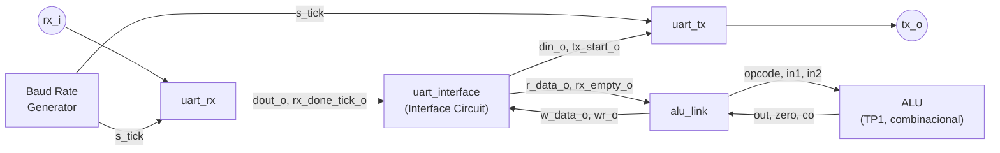
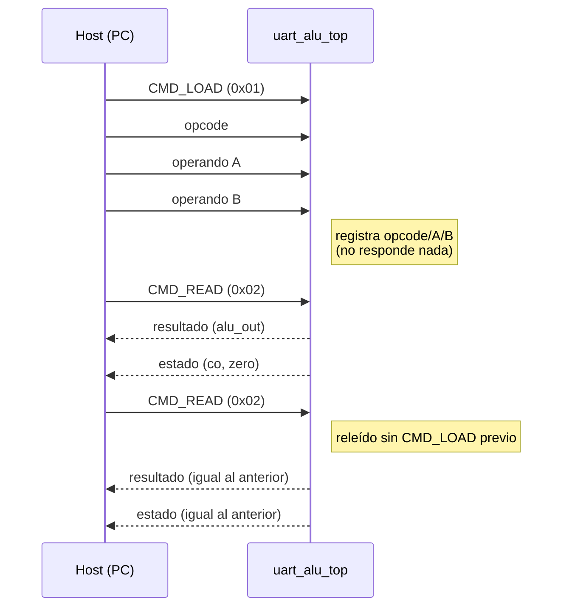
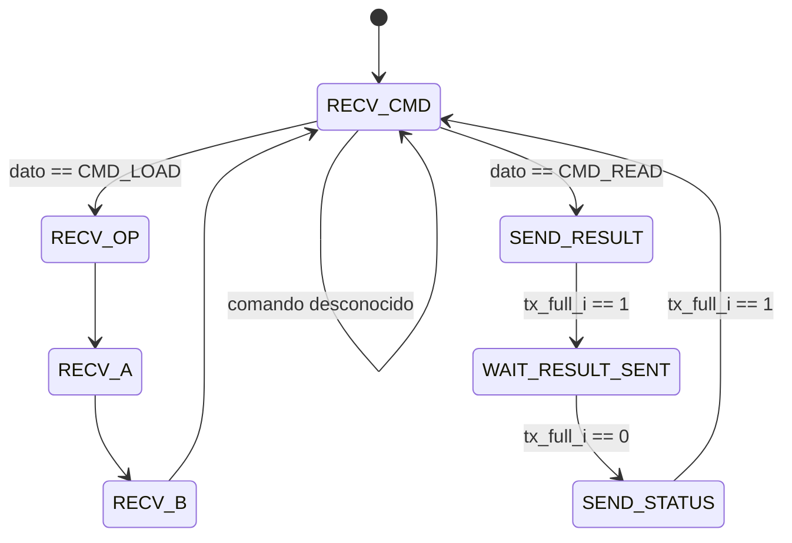

# Informe TP2 — Máquinas de Estado Finitas: UART

**Materia:** Arquitectura de Computadoras  
**Trabajo práctico:** TP2 — Máquinas de Estado Finitas (UART + ALU remota)  
**Alumnos:**  
Vasquez Francisco Javier - 43812221 - javier.vasquez@mi.unc.edu.ar  
Bustos Hugo Gabriel - -  


## Índice

1. [Objetivo](#1-objetivo)
2. [Arquitectura general](#2-arquitectura-general)
   1. [Organización del código](#21-organización-del-código)
   2. [Trama UART](#22-trama-uart)
   3. [Baud Rate Generator](#23-baud-rate-generator)
   4. [Comunicación PC-FPGA: capas del enlace](#24-comunicación-pc-fpga-capas-del-enlace)
3. [Decisiones de diseño](#3-decisiones-de-diseño)
   1. [Máquinas de estado: Moore vs. Mealy](#31-máquinas-de-estado-moore-vs-mealy)
   2. [Codificación de estados](#32-codificación-de-estados)
   3. [FSM segura vs. rápida](#33-fsm-segura-vs-rápida)
   4. [Protocolo de aplicación (Interface Circuit + ALU Link)](#34-protocolo-de-aplicación-interface-circuit--alu-link)
4. [Verificación](#4-verificación)
   1. [Simulación (Icarus Verilog)](#41-simulación-icarus-verilog)
   2. [Síntesis e implementación (Vivado)](#42-síntesis-e-implementación-vivado)
   3. [Validación en hardware real (Basys 3)](#43-validación-en-hardware-real-basys-3)
5. [Herramientas de host](#5-herramientas-de-host)
6. [Conclusiones](#6-conclusiones)

---

## 1. Objetivo

Diseñar e implementar en Verilog un periférico **UART** (Universal Asynchronous
Receiver/Transmitter) que permita comunicar la FPGA con una PC por puerto
serie, y usarlo para **operar la ALU del TP1**: los operandos y
el opcode se envían por serie, y el resultado se lee de vuelta también por
serie. Todo el diseño se modela como **máquinas de estado finitas (FSM)
síncronas**, aplicando los criterios de diseño de la teoría de la cátedra:
Moore vs. Mealy, codificación de estados, y FSM segura vs. rápida.

## 2. Arquitectura general

El sistema sigue el diagrama de bloques del enunciado: un generador de base
de tiempos alimenta un receptor y un transmisor UART, que a su vez se
adaptan mediante un *Interface Circuit* a una interfaz de lectura/escritura
tipo registro que consume la ALU del TP1.



Todo el conjunto se integra en el módulo top `uart_alu_top`, análogo a
`tp1/ALU_top.v` pero con la UART como entrada/salida en lugar de
switches/botones/LEDs.

### 2.1 Organización del código

| Archivo | Responsabilidad |
|---|---|
| `rtl/baud_generator.v` | Contador módulo `N` que genera el tick de muestreo (16× el baud rate), con 4 presets seleccionables en runtime. |
| `rtl/uart_rx.v` | FSM receptora: deserializa `rx_i` en un byte (`dout_o`) + pulso `rx_done_tick_o`. |
| `rtl/uart_tx.v` | FSM transmisora: serializa un byte (`din_i`) hacia `tx_o`, simétrica al Rx. |
| `rtl/uart_interface.v` | *Interface Circuit*: adapta Rx/Tx a una interfaz de 1 byte por sentido (`r_data`/`rd`/`rx_empty`, `w_data`/`wr`/`tx_full`). |
| `rtl/alu_link.v` | Protocolo de aplicación (comando + trigger) sobre esa interfaz; instancia la `ALU` del TP1. |
| `rtl/uart_alu_top.v` | Integración de todo lo anterior; único punto de entrada/salida físico. |
| `tb/*.v` | Un testbench por módulo + un testbench end-to-end (`tb_uart_alu_top.v`). |
| `constraints/uart_alu_top.xdc` | Mapeo de pines para la Basys 3. |
| `host/alu_client.py`, `host/alu_gui.py` | Clientes de PC (línea de comandos y GUI) para operar el sistema por puerto serie. |

### 2.2 Trama UART

```
 start bit   data byte (8 bits, LSB primero)   stop bit
 (nivel 0)                                     (nivel 1)
    S      D0 D1 D2 D3 D4 D5 D6 D7                P
```

La línea está en reposo (`idle`) en `1`. El bit de start (`0`) marca el
comienzo de la trama; le siguen los `N=8` bits de datos (sin bit de
paridad: es opcional según el enunciado, y se decidió no incluirlo — el
muestreo en el punto medio de cada bit con sobremuestreo ×16 ya da margen
de ruido suficiente para un enlace punto a punto de baja distancia como
este). Cierra con `SB_TICKS=16` ticks de stop (1 bit de stop).

Al ser comunicación **asíncrona**, no viaja una señal de clock junto con
los datos: el receptor reconstruye el timing a partir del flanco de bajada
del start bit, apoyándose en el tick 16× del Baud Rate Generator (se
muestrea en el tick 7 para el start —punto medio— y cada 16 ticks después
para cada bit siguiente).

### 2.3 Baud Rate Generator

Genera un tick 16 veces por baud rate: es un contador módulo
`CLK_FREQ / (BaudRate × 16)`. El ejemplo del enunciado (clock de 50 MHz,
19200 baudios) da un módulo ≈163. La placa Basys 3 real tiene un
oscilador de **100 MHz**, no 50 MHz (se corrigió explícitamente el default
de `CLK_FREQ` en `uart_alu_top.v`: sintetizar con el valor genérico de
simulación hubiese corrido todos los baud rates a la mitad de la velocidad
real). Con 100 MHz, el módulo soporta 4 presets de baud rate elegibles en
runtime por `baud_sel_i` (2 bits, pensado para 2 switches físicos de la
Basys3), sin resintetizar:

| Preset | `baud_sel_i` | Baud nominal | `MOD_VALUE` @ 100 MHz | Baud real | Error |
|---|---|---|---|---|---|
| 0 | `00` | 9600 | 651 | ≈9600,6 | ~0,01 % |
| 1 | `01` (default) | 19200 | 325 | ≈19230,8 | ~0,16 % |
| 2 | `10` | 57600 | 108 | ≈57870,4 | ~0,47 % |
| 3 | `11` | 115200 | 54 | ≈115740,7 | ~0,47 % |

El error de cada preset queda muy por debajo de la tolerancia típica de un
enlace UART (varios % acumulados a lo largo de la trama), gracias al
muestreo en el punto medio de cada bit. Al cambiar de preset en caliente,
el contador se reinicia limpio (si no, arrastraría la cuenta vieja y
generaría un primer tick con período mezclado de dos bases de tiempo
distintas).

### 2.4 Comunicación PC-FPGA: capas del enlace

Vale la pena aclarar qué parte de la comunicación PC↔FPGA implementa este TP
y qué parte ya viene resuelta por hardware externo, porque a primera vista
parece que falta trabajo del lado PC (no hay ningún módulo Verilog ni FSM
corriendo ahí) y no es así: son tres capas separadas, y cada una se resuelve
en un lugar distinto.

**Capa física/framing.** La Basys 3 trae un puente USB-Serie **FTDI**
integrado (el mismo chip al que apuntan `rx_i`/`tx_o` en
`constraints/uart_alu_top.xdc`, pines `B18`/`A18`). Ese chip traduce entre
paquetes USB y la señal serie asíncrona *cruda* — no le entrega bytes ya
armados a la FPGA por ningún bus paralelo: el cable entre el FTDI y los
pines de la FPGA sigue siendo la misma trama bit a bit (start/data/stop)
descripta en 2.2. Por eso `uart_rx.v`/`uart_tx.v` siguen siendo
imprescindibles y no un trabajo redundante: son el motor de UART del lado
FPGA, simétrico al que el FTDI ya trae resuelto en silicio del lado PC. El
chip FTDI resuelve "la PC ya no tiene puerto serie físico, necesita hablar
por USB con algo que sí lo tiene"; no resuelve "decodificar bits en la
FPGA", porque ese problema ni siquiera existe de su lado: para el FTDI, la
FPGA es un dispositivo serie más, sin nada de especial.

```
[uart_rx / uart_tx (Verilog, este TP)]  <-- rx_i/tx_o: bits crudos async -->  [motor UART del chip FTDI]
                                                                                       |
                                                                                (traduce a paquetes USB)
                                                                                       |
                                                                          [PC: driver USB-serie + pyserial]
```

**Capa de sincronismo.** No hay clock compartido entre PC y FPGA — por eso
la comunicación es *a*síncrona (2.2). Cada lado genera sus propios ticks a
partir de su propio oscilador (100 MHz en la FPGA vía `baud_generator.v`;
el cristal interno del FTDI del otro lado), sin ninguna relación de fase
entre ambos. Alcanza con que los dos apunten al mismo baud rate *nominal*
(por esto `alu_client.py` valida `--baud` contra los mismos 4 presets de
`BAUD_TO_SEL`, y hay que hacerlo coincidir con `baud_sel_i`): la
resincronización ocurre en cada trama nueva, con el flanco de bajada del
start bit, y el muestreo en el punto medio de cada bit (tick 7 para el
start, cada 16 ticks después) tolera el pequeño error acumulado entre dos
relojes independientes durante los ~10 bits de una trama — el mismo error
de la tabla de presets en 2.3 (0,01 %–0,47 %), muy por debajo de lo que
haría perder sincronía.

**Capa de protocolo de aplicación.** `alu_link.v` (Verilog, lado FPGA) y
`host/alu_client.py` / `host/alu_gui.py` (Python, lado PC) implementan la
misma convención (`CMD_LOAD=0x01`, `CMD_READ=0x02`, orden de bytes de la
respuesta) **por separado**, sin ninguna negociación en tiempo de
ejecución — coinciden porque ambos lados fueron escritos siguiendo la
misma especificación (este mismo documento), no porque haya un mecanismo
que lo garantice. Si el protocolo cambia de un lado sin actualizar el
otro, se desincroniza en silencio (ej. la FPGA esperando un opcode donde
la PC mandó un operando); no hay ningún chequeo de compatibilidad entre
las dos implementaciones.

## 3. Decisiones de diseño

El enunciado pide decidir conscientemente, para cada FSM: Moore vs. Mealy,
codificación de estados, y FSM segura vs. rápida. A continuación se
detalla qué se eligió en cada módulo y por qué.

### 3.1 Máquinas de estado: Moore vs. Mealy

Las tres FSM propiamente dichas del diseño (`uart_rx`, `uart_tx`,
`alu_link`) siguen el patrón estándar de 3 bloques enseñado en la teoría:
registro de estado, lógica de próximo estado, y lógica de salida.

```verilog
// uart_rx.v — registro de estado (memoria)
always @(posedge clk_i, posedge rst_i) begin
    if (rst_i) begin
        state_reg      <= IDLE;
        ...
        dout_o         <= {DBIT{1'b0}};
        rx_done_tick_o <= 1'b0;
    end
    else begin
        state_reg      <= state_next;
        ...
        dout_o         <= dout_next;
        rx_done_tick_o <= rx_done_next;
    end
end
```

**`uart_rx` / `uart_tx` — Moore con salida registrada.** `dout_o` y
`rx_done_tick_o` (Rx), y `tx_o` y `tx_done_tick_o` (Tx), dependen
únicamente del estado (nunca combinacionalmente de `rx_i`, `din_i` o
`tx_start_i`), y además están registrados en el mismo bloque `always
@(posedge clk)` que el resto del estado. Esto corresponde a la opción
**"Output-Equals-State / salida con registro"** de la tabla de
consideraciones de diseño de la teoría: minimiza el delay clock-to-output
y garantiza una salida libre de glitches — importante acá porque `tx_o`
maneja directamente un pin físico hacia la PC, y `dout_o`/`rx_done_tick_o`
son consumidos por otro módulo (`uart_interface`) en el mismo clock, que
necesita verlos ya estables en el flanco en que los muestrea.

**`alu_link` — Mealy en las señales de control (`rd_o`, `wr_o`).** A
diferencia de Rx/Tx, `rd_o` y `wr_o` se calculan combinacionalmente a
partir del estado **y** de `rx_empty_i` / `tx_full_i`:

```verilog
// alu_link.v — RECV_CMD: rd_o depende del estado Y de rx_empty_i (Mealy)
RECV_CMD: begin
    if (~rx_empty_i) begin
        rd_o = 1'b1;
        case (r_data_i)
            CMD_LOAD: state_next = RECV_OP;
            CMD_READ: state_next = SEND_RESULT;
            default:  state_next = RECV_CMD;
        endcase
    end
end
```

Se eligió Mealy acá a propósito: permite reaccionar a un byte disponible
en el mismo ciclo en que `rx_empty_i` baja, en vez de perder un ciclo
adicional esperando a que el estado cambie primero (como forzaría un
Moore puro). Es una elección segura porque la entrada de la que depende
(`rx_empty_i`/`tx_full_i`) no es una señal externa asíncrona, sino una
salida ya registrada de `uart_interface` en el mismo dominio de clock —
la parte realmente asíncrona del sistema (`rx_i`) fue resuelta antes, en
el sincronizador de doble flip-flop de `uart_rx` (ver 3.3).

### 3.2 Codificación de estados

Los tres módulos usan codificación **binaria/secuencial** vía `localparam`
(Rx/Tx: 4 estados en 2 bits; `alu_link`: 7 estados en 3 bits), la opción
de **"mínima cantidad de flip-flops"** de la teoría, en vez de one-hot:

```verilog
localparam [1:0] IDLE  = 2'd0, START = 2'd1, DATA = 2'd2, STOP = 2'd3;
```

La tabla de trade-offs de la teoría recomienda one-hot/one-cold para
**máxima frecuencia**, pero esa ventaja no aplica en este diseño: las FSM
de Rx/Tx/`alu_link` transicionan al ritmo del tick de baud rate (como
mucho ~1,84 MHz con el preset más rápido, 115200×16), muy por debajo de la
frecuencia máxima alcanzable en la FPGA para lógica de esta complejidad.
No hay presión de timing que justifique gastar más flip-flops a cambio de
velocidad que el diseño no va a usar; binaria es la elección consciente
que minimiza área sin costo real.

Un detalle concreto de esto en `alu_link`: 7 estados en 3 bits dejan un
código sin usar (`3'b111`). Ese código solo es alcanzable si el registro
de estado se corrompe (nunca por transición normal del diseño) — y está
cubierto por la rama `default` de la FSM segura (ver 3.3), que lo lleva a
`RECV_CMD` en el siguiente ciclo en vez de dejarlo en un estado no
definido.

### 3.3 FSM segura vs. rápida

Las cuatro FSM/lógica de control del diseño (`uart_rx`, `uart_tx`,
`alu_link`, y el `case` de selección de preset en `baud_rate_generator`)
son **FSM seguras**: toda sentencia `case` de próximo estado tiene una
rama `default` explícita que fuerza la vuelta a un estado conocido
(`IDLE` / `RECV_CMD`), tal como recomienda la teoría para recuperación
ante fallos:

```verilog
default: state_next = IDLE; // Fault recovery
```

Se prefirió seguridad sobre velocidad de forma consciente porque `rx_i` es
la única entrada verdaderamente externa y asíncrona del sistema — no hay
control sobre qué podría inyectar un host mal configurado o ruido en la
línea — y el costo de la lógica de recuperación es insignificante frente
al beneficio de robustez. Como complemento (no es en sí una decisión de
codificación de FSM, pero es la técnica estándar que la acompaña),
`uart_rx` sincroniza `rx_i` con un doble flip-flop antes de usarla en la
FSM, para evitar que una entrada asíncrona propague metaestabilidad hacia
la lógica de estados:

```verilog
always @(posedge clk_i, posedge rst_i) begin
    if (rst_i) begin
        rx_sync1 <= 1'b1;
        rx_sync2 <= 1'b1;
    end else begin
        rx_sync1 <= rx_i;
        rx_sync2 <= rx_sync1;
    end
end
```

### 3.4 Protocolo de aplicación (Interface Circuit + ALU Link)

El enunciado define la interfaz genérica del *Interface Circuit*
(`r_data`/`rd`/`rx_empty`, `w_data`/`wr`/`tx_full`) pero no qué significa
cada byte que circula por ella — esa parte del diseño queda abierta y se
resolvió separando dos responsabilidades:

- **`uart_interface.v`** implementa el *Interface Circuit* en sí: un
  buffer de 1 palabra por sentido (alcanza porque el protocolo consume o
  produce un byte por vez) que no sabe nada de opcodes ni comandos —
  reutilizable para cualquier protocolo que se construya arriba.
- **`alu_link.v`** implementa el protocolo específico de este TP sobre esa
  interfaz, con un primer byte de **comando** que decide qué sigue, en
  vez de un formato posicional fijo (opcode+A+B → respuesta automática).
  Esto separa explícitamente "cargar operandos" de "pedir el resultado",
  lo que permite releer el mismo resultado varias veces sin recargar.

| Comando | Valor | Efecto |
|---|---|---|
| `CMD_LOAD` | `0x01` | Le siguen 3 bytes: opcode (`[5:0]`), operando A, operando B. Carga los registros; no responde nada. |
| `CMD_READ` | `0x02` | Sin bytes adicionales. Dispara el envío de 2 bytes de respuesta sobre el último opcode/A/B cargado. Se puede repetir sin recargar. |
| otro | — | Se descarta (se consume el byte, sin efecto). |

Respuesta a un `CMD_READ` (siempre estos 2 bytes, en este orden):

| # | Byte | Contenido |
|---|---|---|
| 1 | resultado | `alu_out[7:0]` |
| 2 | estado | `{6'b0, co, zero}` (bit1 = co, bit0 = zero) |



La FSM de `alu_link` (7 estados, ver 3.2) implementa este dispatcher:



No hay un estado de "compute" separado: como la `ALU` es puramente
combinacional, para cuando la FSM llega a `SEND_RESULT` los registros
`reg_opcode`/`reg_A`/`reg_B` ya están estables desde el último `CMD_LOAD`
y `alu_out`/`alu_zero`/`alu_co` ya son válidos. `SEND_RESULT` y
`SEND_STATUS` sostienen `wr_o` en alto hasta *ver* `tx_full_i` en alto
(confirma que `uart_interface` aceptó el byte) antes de avanzar, y
`WAIT_RESULT_SENT` espera a que `tx_full_i` vuelva a bajar (confirma que
el primer byte ya se transmitió) antes de intentar el segundo envío — un
handshake de dos pasos que observa la señal de estado real en vez de
asumir que un ciclo alcanza.

La ALU del TP1 (`tp1/ALU.v`, combinacional, sin modificar) soporta estas
operaciones:

| Opcode (bin) | Mnemónico | Operación |
|---|---|---|
| `100000` | ADD | `out = in1 + in2` |
| `100010` | SUB | `out = in1 - in2` |
| `100100` | AND | `out = in1 & in2` |
| `100101` | OR | `out = in1 \| in2` |
| `100110` | XOR | `out = in1 ^ in2` |
| `000011` | SRA | `out = in1 >>> in2` (aritmético) |
| `000010` | SRL | `out = in1 >> in2` (lógico) |
| `100111` | NOR | `out = ~(in1 \| in2)` |
| otro | — | `out = 0`, `co = 0` |

## 4. Verificación

### 4.1 Simulación (Icarus Verilog)

Cada módulo tiene su propio testbench, más uno de integración end-to-end.
Los testbenches de módulo individual (`tb_uart_rx`, `tb_uart_tx`,
`tb_uart_interface`, `tb_alu_link`) usan valores de clock/tick pequeños
para simular rápido; el end-to-end (`tb_uart_alu_top`) sí reproduce
timing de UART real (start + 8 datos + stop, a razón de `CLK_FREQ/BAUD`
ciclos por bit), incluyendo cambio de baud rate en caliente entre
operaciones. Todos se ejecutaron con Icarus Verilog 12.0
(`iverilog`/`vvp`), sin errores ni warnings de diseño:

| Testbench | Resultado |
|---|---|
| `tb_baud_generator.v` | 20/20 ticks verificados con período correcto (25 observados; 4 presets + cambio en caliente) |
| `tb_uart_rx.v` | 16/16 bytes recibidos correctamente |
| `tb_uart_tx.v` | 16/16 bytes transmitidos y decodificados (loopback contra `uart_rx`) |
| `tb_uart_interface.v` | 17/17 verificaciones OK |
| `tb_alu_link.v` | 30/30 operaciones correctas (protocolo completo, alta velocidad) |
| `tb_uart_alu_top.v` | 21/21 operaciones correctas (end-to-end, timing UART real) |

### 4.2 Síntesis e implementación (Vivado)

El proyecto (`tp2/synt/tp2_uart/`) se sintetizó e implementó en Vivado
para una Basys 3 (Xilinx Artix-7, `xc7a35tcpg236-1`), con
`constraints/uart_alu_top.xdc` mapeando clock, reset, `rx_i`/`tx_o` (al
puente USB-serial FTDI integrado de la placa) y `baud_sel_i[1:0]` (a
SW1/SW0). `write_bitstream` completó sin errores (0 errores de DRC, 3
warnings no bloqueantes: uno genérico de propiedades de bitstream
—`CFGBVS-1`— y dos `PDRC-153`, uno por cada bit del registro de 2 bits
`baud_sel_reg` en `baud_generator.v`, que señalan que Vivado lo
implementó con clock gateado en vez de usar el pin de enable; no afecta
el funcionamiento observado, queda como posible mejora de estilo de
síntesis).

### 4.3 Validación en hardware real (Basys 3)

Con el bitstream programado en una Basys 3 física, se validó el sistema
completo hablándole por USB con `host/alu_client.py` (puerto `COM4`,
19200 baudios, switches en `SW0` arriba / resto abajo):

| Operación enviada | Bytes TX | Bytes RX | Resultado | Esperado |
|---|---|---|---|---|
| `ADD(100, 50)` | `01 20 64 32` / `02` | `96 00` | 150, co=0, zero=0 | 100+50=150 ✓ |
| `SUB(10, 50)` | `01 22 0A 32` / `02` | `D8 02` | 216 (signed −40), co=1, zero=0 | 10−50 mod 256=216, borrow ✓ |
| `ADD(200, 100)` | `01 20 C8 64` / `02` | `2C 02` | 44, co=1, zero=0 | 300 mod 256=44, overflow ✓ |
| `AND(240, 15)` | `01 24 F0 0F` / `02` | `00 01` | 0, co=0, zero=1 | 0xF0 & 0x0F=0 ✓ |
| `XOR(255, 15)` | `01 26 FF 0F` / `02` | `F0 00` | 240, co=0, zero=0 | 0xFF ^ 0x0F=0xF0 ✓ |
| `ADD(7, 3)` + 2 `CMD_READ` extra sin recargar | `02` ×3 | `0A 00` ×3 | 10 las 3 veces | releer sin recargar da el mismo resultado ✓ |

Los 6 casos coinciden exactamente con el resultado esperado, incluyendo
los dos casos borde de la ALU (overflow con `co=1` y resultado nulo con
`zero=1`) y el caso que motiva el diseño del protocolo de dos comandos:
pedir `CMD_READ` repetidas veces sin volver a mandar `CMD_LOAD` devuelve
el mismo resultado, confirmado en hardware real y no solo en simulación.

## 5. Herramientas de host

Para operar el sistema desde una PC se construyeron dos clientes en
Python (`tp2/host/`), ambos sobre el mismo módulo de protocolo
(`alu_client.py` expone el armado/parseo de paquetes; nada se duplica
entre uno y otro):

- **`alu_client.py`** — cliente de línea de comandos (`pyserial`): arma un
  `CMD_LOAD` con la operación pedida, dispara uno o más `CMD_READ`
  (`--reread N` para releer sin recargar) y parsea la respuesta.
  ```bash
  python alu_client.py --port COM4 --baud 19200 ADD 100 50
  ```
- **`alu_gui.py`** — GUI de escritorio (tkinter, misma dependencia
  `pyserial`, sin librerías adicionales) pensada para la defensa: permite
  elegir puerto/baud rate, armar y enviar un `CMD_LOAD` desde combos,
  pedir `CMD_READ` (o releerlo N veces con un botón dedicado) y ver el
  resultado con indicadores de `co`/`zero`, con un log que muestra byte a
  byte lo que se envía y se recibe. La comunicación serie corre en un
  thread aparte del hilo de la interfaz para no congelarla mientras
  espera respuesta.
  ```bash
  python alu_gui.py
  ```

_(agregar acá una captura de pantalla de `alu_gui.py` en uso)_

## 6. Conclusiones

El sistema cumple el objetivo del enunciado: la ALU del TP1 se opera de
punta a punta a través de una UART diseñada íntegramente como máquinas de
estado finitas síncronas, verificada tanto en simulación (120 casos entre
los 6 testbenches, sin fallos) como en una Basys 3 real.

Las decisiones de diseño de FSM tomadas de forma consciente —salidas
Moore registradas en Rx/Tx para composición limpia entre módulos del
mismo clock, Mealy acotado a señales de control ya sincronizadas en
`alu_link`, codificación binaria por no haber presión de frecuencia, y
FSM segura en toda la lógica que linda con la única entrada asíncrona del
sistema— no son arbitrarias: cada una responde a una restricción concreta
de este diseño y puede justificarse individualmente, que es exactamente
lo que pide la teoría de la cátedra al plantear estas alternativas como
puntos a decidir y no como recetas fijas.

El protocolo de comando (`CMD_LOAD`/`CMD_READ`) sobre el *Interface
Circuit* genérico separa "cargar operandos" de "leer resultado" como dos
acciones explícitas, lo que valida en hardware real un caso que un
protocolo posicional fijo no podría ofrecer: releer el mismo resultado
varias veces sin recargar.
