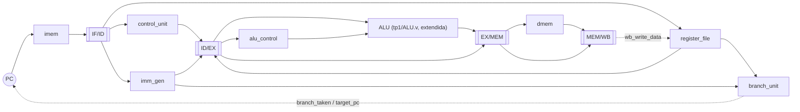
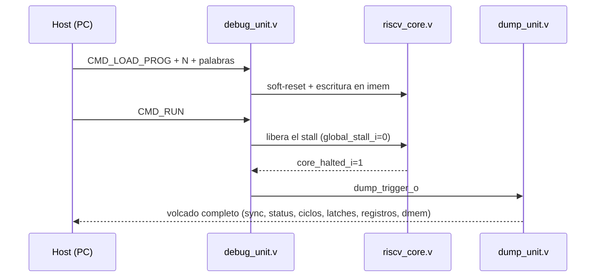

# Informe TP3 — Trabajo Final: Procesador Pipeline RISC-V + Debug Unit

**Materia:** Arquitectura de Computadoras
**Trabajo práctico:** TP3 — Trabajo Final: Pipeline RISC-V + Debug Unit por UART
**Alumnos:**
Vasquez Francisco Javier - 43812221 - javier.vasquez@mi.unc.edu.ar
Bustos Hugo Gabriel - -

## Índice

1. [Objetivo](#1-objetivo)
2. [Arquitectura general](#2-arquitectura-general)
   1. [Organización del código](#21-organización-del-código)
   2. [El pipeline de 5 etapas](#22-el-pipeline-de-5-etapas)
   3. [Riesgos (hazards)](#23-riesgos-hazards)
   4. [Debug Unit y protocolo UART](#24-debug-unit-y-protocolo-uart)
   5. [Reutilización de TP1/TP2](#25-reutilización-de-tp1tp2)
3. [Decisiones de diseño](#3-decisiones-de-diseño)
   1. [Dónde se resuelven los saltos: ID en vez de EX](#31-dónde-se-resuelven-los-saltos-id-en-vez-de-ex)
   2. [HALT: propia y también implícita](#32-halt-propia-y-también-implícita)
   3. [Reprogramación: qué se vacía y qué no](#33-reprogramación-qué-se-vacía-y-qué-no)
   4. [Riesgo estructural: por qué no aparece](#34-riesgo-estructural-por-qué-no-aparece)
   5. [Bypass de escritura-lectura del banco de registros](#35-bypass-de-escritura-lectura-del-banco-de-registros)
   6. [Memorias de lectura asíncrona, no Block RAM](#36-memorias-de-lectura-asíncrona-no-block-ram)
   7. [Volcado completo, no diferencial](#37-volcado-completo-no-diferencial)
   8. [El clock: sin gating, frecuencia pendiente de la Fase 4](#38-el-clock-sin-gating-frecuencia-pendiente-de-la-fase-4)
4. [Verificación](#4-verificación)
5. [Herramientas de host](#5-herramientas-de-host)
6. [Estado del proyecto y próximos pasos](#6-estado-del-proyecto-y-próximos-pasos)
7. [Conclusiones](#7-conclusiones)

---

## 1. Objetivo

Diseñar e implementar un procesador RISC-V (RV32I) con pipeline clásico de
5 etapas (IF-ID-EX-MEM-WB), correlacionado con el capítulo 4 de Patterson
& Hennessy («Computer Organization and Design», edición RISC-V), más una
**Debug Unit** que exponga por UART el contenido de los 32 registros, los
4 latches inter-etapa y la memoria de datos, con dos modos de ejecución
(continuo y paso a paso) y reprogramación dinámica sin resintetizar. Es la
continuación directa de TP1 (la ALU) y TP2 (la UART como FSM), y se apoya
en ambos de forma explícita: la ALU de TP1 pasa a ser la ALU de la etapa
EX, y la capa UART completa de TP2 (`baud_generator.v`, `uart_rx.v`,
`uart_tx.v`, `uart_interface.v`) se reutiliza sin modificar como capa de
transporte de la Debug Unit.

Consigna completa: `tp3/docs/TRABAJO FINAL 2025.pptx.pdf`. Se usó
`tp3/referencia/` (la entrega ya aprobada de un compañero de una cursada
anterior) únicamente para calibrar el alcance esperado antes de diseñar
— se leyó su documentación, no su código — siguiendo al pie de la letra
el pedido explícito del propio enunciado: *"No copien, inspírense"*.

## 2. Arquitectura general

### 2.1 Organización del código

```
tp3/
├── docs/
│   ├── TRABAJO FINAL 2025.pptx.pdf        (consigna)
│   ├── Patterson & Hennessy (RISC-V)...pdf (bibliografía)
│   └── debug_protocol.md                   (protocolo exacto de la Debug Unit)
├── rtl/
│   ├── core/       datapath del pipeline (12 módulos, ver tabla abajo)
│   └── debug/       debug_unit.v, dump_unit.v, riscv_uart_top.v
├── tb/              un testbench por módulo + integración (14 archivos)
├── constraints/      (Fase 4)
├── synt/             (Fase 4)
├── host/             ensamblador, protocolo, CLI y GUI en Python
├── informe.md         este documento
└── README.md          guía práctica / estado del proyecto
```

| Archivo | Responsabilidad |
|---|---|
| `rtl/core/register_file.v` | Banco de 32 registros, x0 fijo en 0, bypass de escritura-lectura (§3.5) |
| `rtl/core/imm_gen.v` | Generador de inmediatos I/S/B/U/J con extensión de signo |
| `rtl/core/control_unit.v` | Decodificador principal (opcode → señales de control) |
| `rtl/core/alu_control.v` | Segundo nivel de decodificación (ALUOp+funct3+funct7 → opcode de ALU) |
| `rtl/core/branch_unit.v` | Comparador + cálculo de destino de beq/bne/jal/jalr, en ID (§3.1) |
| `rtl/core/forwarding_unit.v` | Adelantamiento hacia EX (clásico) y hacia ID (por resolver saltos ahí) |
| `rtl/core/hazard_unit.v` | Detección de stalls (load-use, load-antes-de-branch) y control de flush/bubble |
| `rtl/core/if_id_reg.v`, `id_ex_reg.v`, `ex_mem_reg.v`, `mem_wb_reg.v` | Los 4 latches de pipeline |
| `rtl/core/imem.v`, `dmem.v` | Memoria de instrucciones y de datos, con puerto de carga para la Debug Unit |
| `rtl/core/riscv_core.v` | Integra todo lo anterior en el datapath completo |
| `rtl/debug/debug_unit.v` | FSM de comando+trigger (carga, run/step/reset) |
| `rtl/debug/dump_unit.v` | Serializa el estado completo hacia la UART |
| `rtl/debug/riscv_uart_top.v` | Top sintetizable: UART de TP2 + Debug Unit + Dump Unit + core |
| `host/riscv_asm.py` | Ensamblador + desensamblador del subset de RV32I pedido |
| `host/riscv_protocol.py` | Framing del protocolo, sin E/S (reutilizado por CLI y GUI) |
| `host/riscv_client.py` | Cliente de línea de comandos |
| `host/riscv_gui.py` | GUI de escritorio (tkinter) |

`tp1/ALU.v` se extendió in-place (aditivo, no se tocó ningún opcode
existente) con `sll`/`slt`/`sltu`, que RISC-V necesita y el TP1 original
no tenía.

### 2.2 El pipeline de 5 etapas

Sigue las 5 etapas estándar del enunciado y de Patterson 4.5-4.6 (p.262 y
p.276): IF (Instruction Fetch), ID (Instruction Decode), EX (Execute), MEM
(Memory Access) y WB (Write Back).



Una decisión de diseño transversal a todo el datapath: **todas las
etapas que necesitan `rs1`/`rs2`/`rd`/`funct3`/`funct7` los extraen con un
slice combinacional de la instrucción de 32 bits que viaja completa en
cada latch**, en vez de latchear copias separadas de esos campos — en
RV32I esas posiciones son fijas sin importar el tipo de instrucción (la
misma razón por la que el propio ISA se diseñó así). Cada latch además
lleva la instrucción completa aunque el dato en sí no la necesite más
allá de ID, específicamente para que la Debug Unit pueda mostrar (y
desensamblar) qué instrucción hay en cada etapa en todo momento — ver
§2.4.

**Riesgos de control (saltos) y ALU:** ver §3.1 y la tabla de §2.3 para el
detalle; en resumen, `branch_unit` resuelve beq/bne/jal/jalr enteramente
en ID (no en EX, que sería el diseño más simple de 4.6), y la etapa EX
tiene un mux adicional: si la instrucción es jal/jalr, lo que viaja a
EX/MEM es PC+4 (el valor de enlace), no la salida de la ALU.

**Memoria:** `imem`/`dmem` son de lectura asíncrona (combinacional), no
síncrona como preferiría inferir Vivado para Block RAM — ver §3.6.

### 2.3 Riesgos (hazards)

El enunciado pide tratar los 3 tipos clásicos (Patterson 4.5, p.262):

| Tipo | ¿Aparece acá? | Resolución |
|---|---|---|
| Estructural | No — ver §3.4 | — |
| De datos | Sí | `forwarding_unit.v`: adelantamiento hacia EX (Patterson 4.7, p.294, prioridad EX/MEM > MEM/WB) **y** hacia ID (necesario por resolver saltos ahí, prioridad EX > EX/MEM > MEM/WB) |
| De control | Sí | Saltos resueltos en ID (Patterson 4.8, p.307, fig. 4.62) → 1 burbuja por salto tomado, en vez de 2 |

Casos particulares de riesgo de datos que necesitan detener el pipeline
(no alcanza con adelantar):

- **Load-use clásico**: un consumidor genérico en ID necesita el
  resultado de un load que todavía está en EX (su dato recién está
  disponible al final de MEM). `hazard_unit.v` lo detecta y congela
  PC/IF-ID por 1 ciclo, burbujeando ID/EX.
- **Load justo antes de un branch/jalr**: propio de haber elegido
  resolver saltos en ID. Ni el adelantamiento desde EX (la ALU todavía no
  tiene el dato) ni desde EX/MEM (para un load, ese latch sólo tiene la
  *dirección*, no el dato) llegan a tiempo. `hazard_unit.v` re-evalúa cada
  ciclo si el load sigue "en vuelo" (en EX o en MEM) y sigue frenando
  hasta que el dato ya esté en MEM/WB — 1 ciclo de stall si hay una
  instrucción de por medio entre el load y el salto, 2 si están
  adyacentes.

Ningún stall/flush/burbuja de este proyecto gatea el clock en ningún
punto: todos son enables síncronos sobre PC, IF/ID e ID/EX, tal como pide
el enunciado explícitamente.

### 2.4 Debug Unit y protocolo UART

Especificación exacta en `tp3/docs/debug_protocol.md`. Mismo patrón
"comando + trigger" que ya usaba `tp2/rtl/alu_link.v`: un byte de comando
decide qué sigue, y sólo `CMD_RUN`/`CMD_STEP`/`CMD_DUMP` disparan una
respuesta (un volcado completo del estado).

| Comando | Valor | Efecto |
|---|---|---|
| `CMD_LOAD_PROG` | `0x10` | Carga un programa nuevo en `imem` (limpia toda la memoria antes, dispara soft-reset) |
| `CMD_LOAD_DATA` | `0x11` | Carga datos iniciales en `dmem` (mismo mecanismo) |
| `CMD_RUN` | `0x20` | Modo continuo: corre hasta HALT y vuelca el estado |
| `CMD_STEP` | `0x21` | Modo paso a paso: avanza exactamente 1 ciclo y vuelca el estado |
| `CMD_DUMP` | `0x22` | Vuelca el estado actual sin avanzar |
| `CMD_RESET` | `0x23` | Soft-reset manual, sin tocar las memorias |

El volcado (siempre la misma estructura, sin importar qué lo disparó) es
una secuencia de palabras de 32 bits en little-endian: una marca de
sincronismo, estado (`halted`/`stalled`/`branch_taken`) y contador de
ciclos, los 4 latches de pipeline completos (con sus señales de control
empaquetadas en una palabra por latch), los 32 registros, y finalmente
toda la memoria de datos.



`debug_unit.v` sólo necesita el lado Rx del *Interface Circuit* de TP2
(`uart_interface.v`); `dump_unit.v` sólo el lado Tx. Como cada uno usa una
mitad distinta del mismo módulo, no hace falta arbitrar nada entre los
dos.

### 2.5 Reutilización de TP1/TP2

- **UART completa, sin modificar**: `baud_generator.v`, `uart_rx.v`,
  `uart_tx.v`, `uart_interface.v` de `tp2/rtl/` se referencian
  directamente (no se copian) desde `riscv_uart_top.v` — mismo criterio
  que ya usaba TP2 con `tp1/ALU.v`, un solo source of truth.
- **Patrón de protocolo**: `debug_unit.v` sigue la misma forma que
  `alu_link.v` (comando + trigger), y `dump_unit.v` reutiliza el mismo
  handshake de dos pasos para transmitir que documentó TP2 (sostener `wr`
  hasta ver `tx_full` en alto, esperar a que baje antes del siguiente
  byte).
- **ALU de TP1, extendida**: ver §2.1. Se decidió extenderla en vez de
  escribir una ALU paralela para mantener una sola ALU validada por los
  3 TPs consecutivos — un `alu_control.v` nuevo hace el decode de 2
  niveles {ALUOp, funct3, funct7[5]} → el opcode de 6 bits de
  `tp1/ALU.v`, la misma técnica de "ALU control" de dos niveles que
  describe Patterson (4.4, p.251).
- **Herramientas de host**: se extendió el patrón de `tp2/host/` (CLI
  `pyserial` + GUI `tkinter`, con el protocolo en un módulo separado que
  reutilizan ambos) en vez de adoptar herramientas nuevas — ver §5.

## 3. Decisiones de diseño

El enunciado pide explícitamente identificar los puntos que requieren
"ingenio y toma de decisiones" y documentarlos con su porqué. Esta
sección responde, una por una, a las preguntas abiertas planteadas en la
consigna.

### 3.1 Dónde se resuelven los saltos: ID en vez de EX

Patterson presenta el pipeline en dos etapas de refinamiento (Cap. 4):
primero una versión que resuelve beq en la propia etapa EX (4.6, p.276),
y después, en la sección de riesgos de control (4.8, p.307, fig. 4.62),
mueve la resolución a ID agregando un comparador dedicado —reduce la
penalización de un salto tomado de 2 burbujas a 1, al costo de forwarding
adicional hacia una etapa más temprana.

**Se optó por resolver en ID** (`branch_unit.v`), la variante más fiel al
cierre que el propio libro le da al tema, no la más simple. El costo
concreto: `forwarding_unit.v` necesita una segunda pista de
adelantamiento (hacia ID, con prioridad EX > EX/MEM > MEM/WB, ver §2.3) y
`hazard_unit.v` necesita el caso extendido de "load antes de un branch"
que no existiría si los saltos se resolvieran en EX. A cambio, cualquier
programa con saltos corre con un tercio menos de burbujas por salto
tomado que la alternativa simple.

### 3.2 HALT: propia y también implícita

El subset de instrucciones que pide el enunciado (R/I/S/B/U/J) **no
incluye ninguna instrucción de parada** — hace falta definir una. RV32I
reserva explícitamente los opcodes `custom-0/1/2/3` para extensiones no
estándar (no están asignados a ninguna instrucción estándar, por
diseño). Se usa **custom-0 (`0001011`)** para `HALT`, con el resto de
los campos de la instrucción en cero.

Respuesta a "¿qué pasa si en mi memoria no se encuentra una instrucción
de parada?" (pregunta explícita del enunciado): `CMD_LOAD_PROG` siempre
limpia `imem` **completa** antes de escribir el programa nuevo, no sólo
las palabras que llegaron. Cualquier dirección más allá del programa
cargado queda en `0x00000000`, que no es un opcode válido de RV32I
(`0000000` no está asignado a ninguna instrucción). `control_unit.v`
trata cualquier opcode no reconocido como **HALT implícito** — mismo
mecanismo, misma consecuencia, que la instrucción explícita. Sin esto, un
programa sin `halt` correría indefinidamente contra memoria sin
inicializar.

La condición de halt (explícita o implícita) se decodifica en ID y viaja
por el pipeline como una señal de control más, sin cortar instrucciones
que ya estaban en vuelo — recién cuando llega a WB se la considera
"efectiva" para la Debug Unit (`core_halted_o`). Internamente, la
búsqueda de instrucciones *nuevas* se frena apenas se decodifica el HALT
(no hace falta esperar a WB para eso): el PC queda apuntando a la propia
instrucción de HALT, así que IF la vuelve a buscar cada ciclo — la
condición se auto-sostiene sin necesitar un latch aparte, y es lo que
hace que la flag de halt termine viéndose en todas las etapas un par de
ciclos después.

### 3.3 Reprogramación: qué se vacía y qué no

Preguntas del enunciado: *¿es necesario vaciar la memoria? ¿y los
registros? ¿se necesita vaciar el pipeline? ¿y la memoria de programa?*

| Recurso | ¿Se vacía al reprogramar? | Por qué |
|---|---|---|
| PC | Sí (soft-reset) | Arrancar desde el principio del programa nuevo |
| Banco de registros | Sí (soft-reset) | Estado determinístico, no depender de lo que dejó el programa anterior |
| Latches de pipeline | Sí (soft-reset) | No arrastrar instrucciones a mitad de ejecutar del programa viejo |
| `imem` (memoria de programa) | Sí, completa | Ver §3.2 — garantiza el HALT implícito sin importar el historial de cargas |
| `dmem` (memoria de datos) | **No**, salvo `CMD_LOAD_DATA` explícito | Análogo a que una computadora real no borra la RAM sola al reiniciar |

Tanto `CMD_LOAD_PROG` como `CMD_LOAD_DATA` disparan el mismo soft-reset
(PC/registros/latches) — no tendría sentido dejar al pipeline en un
estado a mitad de ejecución mientras se carga contenido nuevo en
cualquiera de las dos memorias. Todo esto son señales de control internas
del propio diseño: nunca se re-sintetiza ni se toca el bitstream para
reprogramar, tal como exige el enunciado.

### 3.4 Riesgo estructural: por qué no aparece

El enunciado pide tratar los 3 tipos de riesgo aunque la respuesta sea
"no aplica" — con su porqué. Un riesgo estructural ocurre cuando dos
instrucciones necesitan el mismo recurso físico en el mismo ciclo. En
este diseño no puede pasar porque:

- `register_file.v` tiene puertos de lectura y de escritura
  **separados** (2 lecturas asíncronas + 1 escritura síncrona): ID lee y
  WB escribe en el mismo ciclo sin contención, exactamente como asume el
  propio pipeline de Patterson.
- `imem`/`dmem` tienen el puerto de acceso del pipeline separado del
  puerto de carga de la Debug Unit, y este último **sólo escribe
  mientras el pipeline está congelado** (`global_stall_i=1` durante toda
  una carga) — nunca hay un acceso real del core y una escritura de la
  Debug Unit en el mismo ciclo.
- No hay una única ALU compartida entre etapas (la ALU vive sólo en EX;
  `branch_unit.v` en ID tiene su propio comparador y sumador
  independientes).

### 3.5 Bypass de escritura-lectura del banco de registros

Se encontró integrando `riscv_core.v` (Fase 1), no fue un diseño previsto
desde el principio, y vale la pena documentarlo como el tipo de detalle
no obvio que el enunciado pide identificar. `forwarding_unit.v` cubre
productores 1 y 2 instrucciones antes del consumidor (vía EX/MEM y
MEM/WB). Un productor **exactamente 3 instrucciones antes** ya salió de
ambos latches — pero para ese momento tampoco terminó de escribirse en el
banco de registros: la escritura de WB y la lectura de ID del consumidor
caen en el **mismo ciclo de reloj**, y una lectura puramente combinacional
del arreglo interno vería el valor viejo.

La solución (y la que aplica Patterson en su propio diseño del banco de
registros, ver 4.6) es un bypass interno: si en el mismo ciclo se está
escribiendo la dirección que se está leyendo, la lectura devuelve
directamente el dato que se está escribiendo, no el que todavía está en
el arreglo:

```verilog
assign rs1_data_o = (rs1_addr_i == 5'd0) ? 32'b0 :
                     bypass_rs1           ? rd_data_i :
                                             regs[rs1_addr_i];
```

Sin este bypass, ninguna de las tres fuentes disponibles (adelantamiento
desde EX/MEM, desde MEM/WB, o lectura directa del banco) cubre ese caso
puntual — se manifestó como un resultado incorrecto en el primer intento
de `tb_riscv_core.v` con un programa de instrucciones R-type consecutivas,
y quedó cubierto por los 461 tests de Verilog que corren hoy.

### 3.6 Memorias de lectura asíncrona, no Block RAM

El enunciado sugiere investigar los IP Cores de Vivado para memorias.
Se investigaron y se decidió **no** usar el Block RAM que Vivado prefiere
inferir para lectura síncrona: agrega un ciclo de latencia entre
dirección y dato que no está en el modelo de 5 etapas de Patterson, y el
datapath dejaría de calzar 1 a 1 con las figuras del libro (motivaría una
etapa adicional o una latencia extra en IF/MEM que el capítulo 4 no
contempla).

En cambio, `imem.v`/`dmem.v` usan lectura asíncrona (`assign dout =
mem[addr]`), que a la profundidad usada en este proyecto (1024 palabras
en `imem`, 256 en la `dmem` del top sintetizable — ver §3.7) se esperaba
que Vivado infiriera como *distributed RAM* (LUTRAM) en vez de Block RAM,
con un costo de área marginal en la Artix-7 del Basys3.

**Esa expectativa resultó incorrecta en la primera síntesis real (Fase
4), y es el mejor ejemplo concreto de este proyecto de algo que la
simulación funcional no puede detectar.** La primera corrida de `Run
Implementation` falló por DRC: el diseño pedía 43337 flip-flops contra
los 41600 disponibles en la `xc7a35tcpg236-1` (104% de utilización), con
el uso de LUTs ya en 92%. La causa no era la profundidad de las memorias
en sí, sino cómo estaba descripto `load_clear_i` (la señal que vacía
`imem`/`dmem` en cada `CMD_LOAD_PROG`/`CMD_LOAD_DATA`, ver §3.3): un
`for` que escribía las `DEPTH_WORDS` direcciones **en el mismo ciclo**.
Ese patrón —todas las direcciones cambiando a la vez, atadas a una sola
señal de control en vez de a un puerto de dirección— es exactamente lo
que le impide a cualquier herramienta de síntesis inferir una RAM real
(LUTRAM o Block RAM): una RAM sólo puede escribir **una** dirección por
ciclo. Sin ese template, Vivado no tuvo otra opción que sintetizar cada
palabra como flip-flops individuales, más un multiplexor de lectura
gigante (`mem[addr]` resuelto sobre miles de flip-flops en vez del
decodificador nativo de una RAM) — de ahí que tanto FF como LUT se
dispararan, con `imem` (4 veces más profundo que `dmem`) como principal
responsable. Los 522 tests de simulación (Icarus Verilog) pasaban sin
problema durante todo este tiempo, porque un simulador no distingue si
un `for` sintetiza como RAM o como flip-flops — sólo evalúa el
comportamiento, no el costo en hardware real.

La corrección, en `imem.v`/`dmem.v`, reemplaza el `for` por un barrido
secuencial: al recibir `load_clear_i`, un contador interno recorre las
`DEPTH_WORDS` direcciones **una por ciclo**, escribiendo cero por el
mismo puerto que ya usa `load_en_i` — así todo el módulo cae dentro del
template de "una escritura, una dirección, por ciclo" que Vivado sí sabe
mapear a LUTRAM. Se agregó una salida `clear_busy_o`, que
`debug_unit.v` espera (nuevo estado `LOAD_CLEAR_WAIT`) antes de empezar a
recibir el programa nuevo por UART — si no, las primeras palabras
cargadas correrían el riesgo de perderse contra la cola del barrido de
limpieza. El costo en tiempo es despreciable: a 100MHz, barrer 1024
direcciones son ~10µs, frente a los ~107ms que ya tarda un volcado
completo por UART (§3.7). Reverificado con los mismos 522 tests (incluida
la integración end-to-end con UART real, que ejercita `LOAD_CLEAR_WAIT`
con `imem.v`/`dmem.v` reales, no mockeados) antes de volver a sintetizar;
los números de utilización tras esta corrección quedan para completar
acá una vez repetida la síntesis.

### 3.7 Volcado completo, no diferencial

`dump_unit.v` manda siempre el estado completo (todos los latches, los
32 registros, toda la `dmem`), nunca sólo lo que cambió desde el volcado
anterior. Es la opción más simple de implementar y de razonar (un solo
formato de paquete, sin necesidad de rastrear qué cambió ciclo a ciclo),
al costo de ancho de banda: con la `dmem` de 256 palabras del top
sintetizable, un volcado pesa `(53 + 256) × 4 = 1236` bytes, unos ~107ms
a 115200 baudios — aceptable para un paso a paso interactivo. Con el
default de 1024 palabras de `riscv_core.v` hubiese sido ~375ms,
notoriamente peor; por eso el top sintetizable usa una `dmem` más chica
que el default del núcleo (ambos son parámetros independientes,
`DMEM_DEPTH_WORDS`).

### 3.8 El clock: sin gating, camino crítico medido, Clock Wizard pendiente de aplicar

Ningún stall, freeze o burbuja de este diseño gatea el clock: todo el
control de flujo se resuelve con **enables síncronos** sobre los
registros correspondientes (PC, IF/ID, ID/EX) y con resets síncronos
controlados por la propia lógica de la Debug Unit, tal como exige el
enunciado explícitamente.

**Camino crítico**, medido en la primera síntesis + implementación real
(Fase 4): a 100MHz (10ns) el diseño no cierra timing — Worst Negative
Slack (WNS) = -3.633ns, Total Negative Slack (TNS) = -320ns sobre 144
endpoints fallando (de 18325 totales). El peor path completo:

- **Origen:** `u_core/u_id_ex/instr_o_reg[20]` — un bit de la instrucción
  latcheada en ID/EX.
- **Destino:** `u_dump/current_word_reg_reg[1]` — el contador de palabra
  actual de la Dump Unit.
- **13.604ns de delay de datos, 19 niveles de lógica** (3×CARRY4, 2×LUT4,
  3×LUT5, 8×LUT6, 2×MUXF7, 1×MUXF8).

Los 3 peores paths reportados comparten el mismo origen y el mismo tramo
inicial (hasta `u_core/u_if_id/branch_taken`), y sólo se diferencian en
el destino final (la Dump Unit en un caso, latches de `if_id_reg` en los
otros dos) — la señal cara de calcular es **`branch_taken`**, no los
registros que la consumen después. Coincide exactamente con la decisión
de diseño de §3.1: resolver los saltos en ID exige, en un solo ciclo,
adelantar rs1/rs2 (forwarding con prioridad EX/MEM > MEM/WB, de ahí los
pasos por `rs2_data_o` de `ex_mem`/`mem_wb` en el path), compararlos, y
calcular el target con un sumador de 32 bits (los `CARRY4` encadenados
sobre `pc_reg`) — todo antes de que termine el ciclo. Es el costo
concreto, ahora medido, de haber elegido la variante de Patterson fig.
4.62 (branch resuelto en ID) en vez de la más simple resuelta en EX: un
camino combinacional más largo que compite con -- y en este caso supera
-- el presupuesto de un ciclo a 100MHz. `dump_unit.v`/`if_id_reg.v` no
son la causa: heredan el retraso porque su lógica depende de
`branch_taken`, no porque tengan un problema propio.

(El mismo reporte muestra además 3 *recovery checks* sobre `core_rst`
llegando al `CLR` asíncrono de varios registros -- cierran con margen
positivo de ~2ns cada una, no son un problema.)

**Frecuencia a aplicar:** con 100MHz descartado, se va a generar un
clock derivado más lento con el **Clock Wizard** de Vivado (IP Catalog),
tal como sugiere el tip del enunciado -- nunca dividiendo el clock a
mano con lógica propia, que sí sería intervenirlo. El delay medido
(13.6ns) da un máximo teórico de ~73MHz sin margen; se aplican **50MHz**
(20ns, ~6.4ns de margen sobre el peor path medido) por ser una fracción
simple de los 100MHz de la placa y dejar margen amplio frente a
variaciones de post-síntesis. Sección a completar con la confirmación
final una vez vuelto a sintetizar con el clock derivado.

Referencia teórica: Patterson, Apéndice A.11 (p.A-71).

## 4. Verificación

Cada módulo de Verilog tiene su propio testbench (Icarus Verilog,
mismo criterio de rigor que TP1/TP2: resultados verificados contra
valores esperados a mano, no revisados a ojo), más testbenches de
integración; cada módulo de Python tiene su propia suite de tests
(`unittest`).

| Testbench / suite | Resultado |
|---|---|
| `tp1/tb_alu.v` (regresión, confirma que extender la ALU no rompió nada) | 162/162 |
| `tb_register_file.v` | 15/15 |
| `tb_imm_gen.v` | 11/11 |
| `tb_control_unit.v` | 19/19 |
| `tb_alu_control.v` | 20/20 |
| `tb_branch_unit.v` | 7/7 |
| `tb_forwarding_unit.v` | 10/10 |
| `tb_hazard_unit.v` | 10/10 |
| `tb_pipeline_regs.v` | 30/30 |
| `tb_imem.v` | 5/5 |
| `tb_dmem.v` | 20/20 |
| `tb_riscv_core.v` (integración del datapath completo) | 56/56 |
| `tb_debug_unit.v` | 29/29 |
| `tb_dump_unit.v` | 58/58 |
| `tb_riscv_uart_top.v` (integración de punta a punta, UART real bit a bit) | 9/9 |
| **Subtotal Verilog** | **461/461** |
| `test_riscv_asm.py` | 41/41 |
| `test_riscv_protocol.py` | 19/19 |
| `test_riscv_client.py` (con un puerto serie simulado) | 1/1 |
| **Subtotal Python** | **61/61** |
| **Total** | **522/522** |

`tb_riscv_core.v` corre programas RV32I reales (armados con los mismos
encoders que usa `host/riscv_asm.py`, ver `tp3/tb/riscv_isa_encode.vh`)
que ejercitan cada tipo de instrucción, la prioridad de adelantamiento
EX/MEM sobre MEM/WB, ambos hazards de stall, y HALT explícito e
implícito. `tb_riscv_uart_top.v` va un paso más allá: en vez de manejar
la interfaz Rx/Tx a nivel de registro, banguea la línea `rx_i` bit a bit
como lo haría una PC real y decodifica `tx_o` de la misma forma,
atravesando la cadena completa (UART de TP2 + Debug Unit + Dump Unit +
core) sin atajos.

Dos hallazgos de la etapa de integración, además del bypass del banco de
registros (§3.5), quedaron documentados directamente en el código porque
son el tipo de detalle que vale la pena que quede a la vista:

- Un bug real en `tp2/rtl/baud_generator.v` (no en código nuevo de TP3):
  dimensiona su contador con `$clog2(MOD_MAX)`, que alcanza para *contar*
  hasta `MOD_MAX-1` pero no siempre para *representar* el valor
  `MOD_MAX` en sí — si `MOD_MAX` es una potencia de 2 exacta, el
  generador de baudios deja de tickear. No afecta al hardware real
  (ninguno de los 4 baud rates de la Basys3 a 100MHz cae justo en una
  potencia de 2), así que no se tocó ese archivo; se documentó el
  hallazgo y se evitó el caso al elegir los parámetros de simulación de
  `tb_riscv_uart_top.v`.
- El programa de prueba de `tb_riscv_uart_top.v` es tan chico que el core
  llega a HALT y `dump_unit.v` ya empieza a responder mientras el
  testbench todavía está terminando de transmitir el último byte del
  comando — canal full-duplex real. Enviar y recibir tienen que correr
  **en paralelo** (`fork`/`join`), no en secuencia, o el receptor arranca
  tarde y pierde el bit de inicio de la trama.

## 5. Herramientas de host

`tp3/host/` (Python 3, única dependencia externa `pyserial`, igual que
TP2):

- **`riscv_asm.py`** — ensamblador y desensamblador del subset de RV32I
  pedido. Acepta nombres de registro numéricos (`x0`-`x31`) y ABI
  (`ra`, `sp`, `a0`, etc.), etiquetas, y comentarios. Las tablas de
  opcode/funct3/funct7 están duplicadas a propósito en tres lugares que
  tienen que coincidir bit a bit (`control_unit.v`/`alu_control.v`,
  `tp3/tb/riscv_isa_encode.vh`, y este módulo) — no hay un mecanismo de
  import de constantes entre Verilog y Python.
- **`riscv_protocol.py`** — arma los paquetes de comando y decodifica el
  volcado de estado, sin ninguna dependencia de E/S: se puede probar con
  datos sintéticos sin hardware de por medio, y lo reutilizan tanto la
  CLI como la GUI sin duplicar el parseo.
- **`riscv_client.py`** — cliente de línea de comandos, análogo a
  `tp2/host/alu_client.py`:
  ```
  python riscv_client.py --port COM4 --dmem-words 256 programa.asm
  python riscv_client.py --port COM4 --mode step --steps 20 programa.asm
  ```
- **`riscv_gui.py`** — GUI de escritorio (tkinter), pensada para la
  defensa, con el mismo patrón de threads que `tp2/host/alu_gui.py` (la
  comunicación serie corre en un worker aparte, nunca toca widgets
  directamente, todo pasa por una cola que el `mainloop` drena con
  `after()`). Editor de programa, botones Run/Step/Reset/Dump, panel de
  los 32 registros, una tarjeta por etapa de pipeline con la instrucción
  ya desensamblada, visor de memoria, y el mismo log byte a byte que ya
  tenía la GUI de TP2.
  ```
  python riscv_gui.py
  ```

## 6. Estado del proyecto y próximos pasos

- [x] **Fase 1** — Datapath completo (`rtl/core/`), 201 tests.
- [x] **Fase 2** — Debug Unit + Dump Unit + top UART (`rtl/debug/`), 260 tests.
- [x] **Fase 3** — Herramientas de host (`host/`), 61 tests.
- [ ] **Fase 4** — Proyecto Vivado, síntesis, timing closure (§3.8 queda
      pendiente hasta esta fase).
- [ ] **Fase 5** — Validación en una Basys 3 real.

Ver `tp3/README.md` para el detalle práctico de cómo correr cada
verificación y los próximos pasos concretos.

## 7. Conclusiones

El pipeline implementa el subset de RV32I completo que pide el
enunciado, con las tres clases de riesgo tratadas explícitamente
(incluido el estructural, con su justificación de por qué no aparece), y
con la variante de resolución de saltos en ID que el propio Patterson
presenta como el cierre natural del tema de riesgos de control — no la
alternativa más simple, la más correlacionable con el libro. Cada
pregunta abierta que plantea el enunciado (reprogramación, HALT ausente,
riesgo estructural) tiene una respuesta concreta e implementada, no sólo
discutida; la única que sigue abierta (camino crítico, skew, frecuencia)
depende de una herramienta externa (Vivado) que todavía no se corrió, no
de una decisión de diseño pendiente.

La Debug Unit expone exactamente lo que pide el enunciado (registros,
latches, memoria) con un protocolo propio, inspirado en el patrón
comando+trigger que ya había probado su robustez en TP2, y las
herramientas de host (ensamblador, CLI y GUI) extienden directamente lo
que ese mismo TP2 ya había construido en vez de empezar de cero.

Las 522 verificaciones automáticas (461 en Verilog, 61 en Python) cubren
cada instrucción del set pedido, cada camino de adelantamiento, ambos
hazards de stall, HALT explícito e implícito, el protocolo completo de
la Debug Unit incluyendo el bit-banging real de UART, y el camino de
datos completo del lado de host — no reemplazan la síntesis ni la
validación en hardware real que faltan (Fases 4 y 5), pero dejan ese
trabajo apoyado sobre una base cuya lógica ya está confirmada
correcta en simulación.
