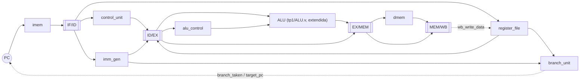
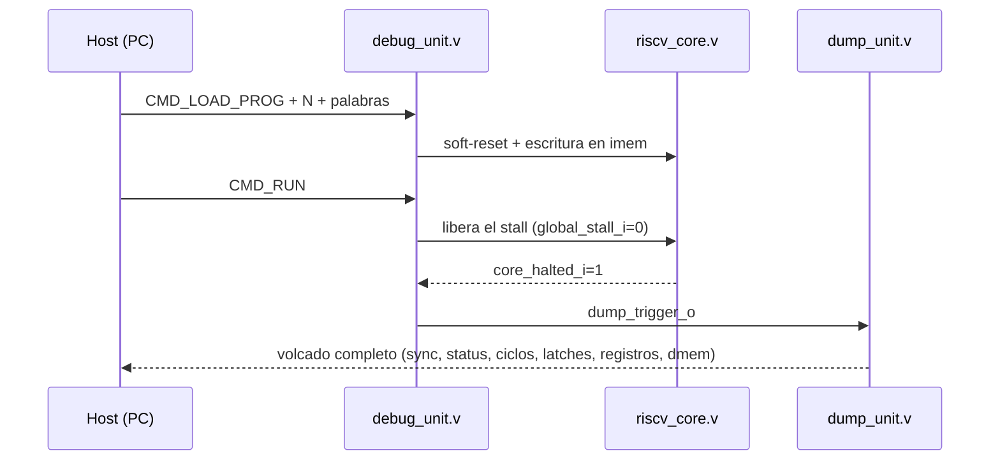

# Informe TP3 — Trabajo Final: Procesador Pipeline RISC-V + Debug Unit

**Materia:** Arquitectura de Computadoras
**Trabajo práctico:** TP3 — Trabajo Final: Pipeline RISC-V + Debug Unit por UART
**Alumnos:**
Vasquez Francisco Javier - 43812221 - javier.vasquez@mi.unc.edu.ar
Bustos Hugo Gabriel - -

## Índice

1. [Objetivo](#1-objetivo)
2. [Arquitectura general](#2-arquitectura-general)
   1. [Organización del código](#21-organización-del-código)
   2. [El pipeline de 5 etapas](#22-el-pipeline-de-5-etapas)
   3. [Riesgos (hazards)](#23-riesgos-hazards)
   4. [Debug Unit y protocolo UART](#24-debug-unit-y-protocolo-uart)
   5. [Reutilización de TP1/TP2](#25-reutilización-de-tp1tp2)
3. [Decisiones de diseño](#3-decisiones-de-diseño)
   1. [Dónde se resuelven los saltos: ID en vez de EX](#31-dónde-se-resuelven-los-saltos-id-en-vez-de-ex)
   2. [HALT: propia y también implícita](#32-halt-propia-y-también-implícita)
   3. [Reprogramación: qué se vacía y qué no](#33-reprogramación-qué-se-vacía-y-qué-no)
   4. [Riesgo estructural: por qué no aparece](#34-riesgo-estructural-por-qué-no-aparece)
   5. [Bypass de escritura-lectura del banco de registros](#35-bypass-de-escritura-lectura-del-banco-de-registros)
   6. [Memorias de lectura asíncrona, no Block RAM](#36-memorias-de-lectura-asíncrona-no-block-ram)
   7. [Volcado completo, no diferencial](#37-volcado-completo-no-diferencial)
   8. [El clock: sin gating, camino crítico medido, Clock Wizard pendiente de aplicar](#38-el-clock-sin-gating-camino-crítico-medido-clock-wizard-pendiente-de-aplicar)
   9. [Paso a paso: congelamiento total del núcleo](#39-paso-a-paso-congelamiento-total-del-núcleo)
4. [Verificación](#4-verificación)
5. [Herramientas de host](#5-herramientas-de-host)
6. [Estado del proyecto y próximos pasos](#6-estado-del-proyecto-y-próximos-pasos)
7. [Conclusiones](#7-conclusiones)

---

## 1. Objetivo

Diseñar e implementar un procesador RISC-V (RV32I) con pipeline clásico de
5 etapas (IF-ID-EX-MEM-WB), correlacionado con el capítulo 4 de Patterson
& Hennessy («Computer Organization and Design», edición RISC-V), más una
**Debug Unit** que exponga por UART el contenido de los 32 registros, los
4 latches inter-etapa y la memoria de datos, con dos modos de ejecución
(continuo y paso a paso) y reprogramación dinámica sin resintetizar. Es la
continuación directa de TP1 (la ALU) y TP2 (la UART como FSM), y se apoya
en ambos de forma explícita: la ALU de TP1 pasa a ser la ALU de la etapa
EX, y la capa UART completa de TP2 (`baud_generator.v`, `uart_rx.v`,
`uart_tx.v`, `uart_interface.v`) se reutiliza sin modificar como capa de
transporte de la Debug Unit.

Consigna completa: `tp3/docs/TRABAJO FINAL 2025.pptx.pdf`.

## 2. Arquitectura general

### 2.1 Organización del código

```
tp3/
├── docs/
│   ├── TRABAJO FINAL 2025.pptx.pdf        (consigna)
│   ├── Patterson & Hennessy (RISC-V)...pdf (bibliografía)
│   └── debug_protocol.md                   (protocolo exacto de la Debug Unit)
├── rtl/
│   ├── core/       datapath del pipeline (12 módulos, ver tabla abajo)
│   └── debug/       debug_unit.v, dump_unit.v, riscv_uart_top.v
├── tb/              un testbench por módulo + integración (14 archivos)
├── constraints/      (Fase 4)
├── synt/             (Fase 4)
├── host/             ensamblador, protocolo, CLI y GUI en Python
├── informe.md         este documento
└── README.md          guía práctica / estado del proyecto
```

| Archivo | Responsabilidad |
|---|---|
| `rtl/core/register_file.v` | Banco de 32 registros, x0 fijo en 0, bypass de escritura-lectura (§3.5) |
| `rtl/core/imm_gen.v` | Generador de inmediatos I/S/B/U/J con extensión de signo |
| `rtl/core/control_unit.v` | Decodificador principal (opcode → señales de control) |
| `rtl/core/alu_control.v` | Segundo nivel de decodificación (ALUOp+funct3+funct7 → opcode de ALU) |
| `rtl/core/branch_unit.v` | Comparador + cálculo de destino de beq/bne/jal/jalr, en ID (§3.1) |
| `rtl/core/forwarding_unit.v` | Adelantamiento hacia EX (clásico) y hacia ID (por resolver saltos ahí) |
| `rtl/core/hazard_unit.v` | Detección de stalls (load-use, load-antes-de-branch) y control de flush/bubble |
| `rtl/core/if_id_reg.v`, `id_ex_reg.v`, `ex_mem_reg.v`, `mem_wb_reg.v` | Los 4 latches de pipeline |
| `rtl/core/imem.v`, `dmem.v` | Memoria de instrucciones y de datos, con puerto de carga para la Debug Unit |
| `rtl/core/riscv_core.v` | Integra todo lo anterior en el datapath completo |
| `rtl/debug/debug_unit.v` | FSM de comando+trigger (carga, run/step/reset) |
| `rtl/debug/dump_unit.v` | Serializa el estado completo hacia la UART |
| `rtl/debug/riscv_uart_top.v` | Top sintetizable: UART de TP2 + Debug Unit + Dump Unit + core |
| `host/riscv_asm.py` | Ensamblador + desensamblador del subset de RV32I pedido |
| `host/riscv_protocol.py` | Framing del protocolo, sin E/S (reutilizado por CLI y GUI) |
| `host/riscv_client.py` | Cliente de línea de comandos |
| `host/riscv_pipeview.py` | Interpreta un volcado: qué hay en cada etapa, forwarding, stalls, diagrama multiciclo (sin E/S ni tkinter) |
| `host/riscv_gui.py` | GUI de escritorio (tkinter) |

`tp1/ALU.v` se extendió in-place (aditivo, no se tocó ningún opcode
existente) con `sll`/`slt`/`sltu`, que RISC-V necesita y el TP1 original
no tenía.

### 2.2 El pipeline de 5 etapas

Sigue las 5 etapas estándar del enunciado y de Patterson 4.5-4.6 (p.262 y
p.276): IF (Instruction Fetch), ID (Instruction Decode), EX (Execute), MEM
(Memory Access) y WB (Write Back).


```mermaid
flowchart LR
    PC(("PC")) --> IMEM["imem"]
    IMEM --> IFID[["IF/ID"]]

    IFID --> CU["control_unit"]
    IFID --> RF["register_file"]
    IFID --> IG["imm_gen"]
    RF --> BU["branch_unit"]
    IG --> BU
    BU -. "branch_taken / target_pc" .-> PC

    CU --> IDEX[["ID/EX"]]
    RF --> IDEX
    IG --> IDEX
    IDEX --> AC["alu_control"]
    IDEX --> ALU["ALU (tp1/ALU.v, extendida)"]
    AC --> ALU

    ALU --> EXMEM[["EX/MEM"]]
    IDEX --> EXMEM
    EXMEM --> DM["dmem"]

    DM --> MEMWB[["MEM/WB"]]
    EXMEM --> MEMWB
    MEMWB -. "wb_write_data" .-> RF
```

Una decisión de diseño transversal a todo el datapath: **todas las
etapas que necesitan `rs1`/`rs2`/`rd`/`funct3`/`funct7` los extraen con un
slice combinacional de la instrucción de 32 bits que viaja completa en
cada latch**, en vez de latchear copias separadas de esos campos — en
RV32I esas posiciones son fijas sin importar el tipo de instrucción (la
misma razón por la que el propio ISA se diseñó así). Cada latch además
lleva la instrucción completa aunque el dato en sí no la necesite más
allá de ID, específicamente para que la Debug Unit pueda mostrar (y
desensamblar) qué instrucción hay en cada etapa en todo momento — ver
§2.4.

**Riesgos de control (saltos) y ALU:** ver §3.1 y la tabla de §2.3 para el
detalle; en resumen, `branch_unit` resuelve beq/bne/jal/jalr enteramente
en ID (no en EX, que sería el diseño más simple de 4.6), y la etapa EX
tiene un mux adicional: si la instrucción es jal/jalr, lo que viaja a
EX/MEM es PC+4 (el valor de enlace), no la salida de la ALU.

**Memoria:** `imem`/`dmem` son de lectura asíncrona (combinacional), no
síncrona como preferiría inferir Vivado para Block RAM — ver §3.6.

**Accesos desalineados y fuera de rango.** El enunciado no pide
excepciones y el diseño no las tiene, pero qué pasa en estos casos está
definido:

- **Desalineados:** se ignoran los bits bajos de la dirección que
  harían falta para alinear el acceso, y se usa la palabra o media
  palabra alineada que contiene esa dirección. Un `lw`/`sw` a `0x6`
  accede a la palabra de `0x4`; un `lh`/`lhu`/`sh` a `0x3` accede a la
  media palabra de `0x2`. Los accesos de un byte siempre están
  alineados. Un RISC-V completo tendría que resolver el acceso
  desalineado bien o generar una excepción; acá no hay excepciones, y
  los programas de este TP usan direcciones alineadas.
- **Destinos de salto no múltiplos de 4:** `jalr` sólo fuerza a 0 el
  bit 0 del destino (así lo define la especificación) y los offsets de
  `beq`/`bne`/`jal` sólo tienen que ser pares, así que un destino con
  el bit 1 en 1 es posible: con `jalr`, según el valor de `rs1` en
  ejecución; con un salto, si se escribe un offset numérico como `6`
  (con etiquetas, el ensamblador siempre calcula múltiplos de 4). `imem`
  también ignora los bits `[1:0]` del PC, así que se ejecuta la palabra
  alineada que contiene esa dirección, y el PC (y con él los valores de
  enlace de `jal`/`jalr`) sigue corrido en 2. Un RISC-V completo
  generaría una excepción de dirección de instrucción desalineada.
- **Fuera de rango:** cada memoria usa sólo los bits de dirección que
  necesita (`imem` de 1024 palabras usa los bits `[11:2]`; la `dmem` de
  256 palabras del top, los bits `[9:2]`). Una dirección más allá del
  tamaño se pliega sobre el principio: en la `dmem` de 256 palabras, un
  `lw` a `0x400` lee la palabra 0. Para la carga por UART, el host
  valida el tamaño antes de mandar nada (§5).

### 2.3 Riesgos (hazards)

El enunciado pide tratar los 3 tipos clásicos (Patterson 4.5, p.262):

| Tipo | ¿Aparece acá? | Resolución |
|---|---|---|
| Estructural | No — ver §3.4 | — |
| De datos | Sí | `forwarding_unit.v`: adelantamiento hacia EX (Patterson 4.7, p.294, prioridad EX/MEM > MEM/WB) **y** hacia ID (necesario por resolver saltos ahí; incluye adelantar el resultado de la ALU del mismo ciclo, decisión propia explicada en §3.1, prioridad EX > EX/MEM > MEM/WB) |
| De control | Sí | Saltos resueltos en ID (Patterson 4.8, p.307, fig. 4.62) → 1 burbuja por salto tomado, en vez de 2 |

Casos particulares de riesgo de datos que necesitan detener el pipeline
(no alcanza con adelantar):

- **Load-use clásico**: un consumidor genérico en ID necesita el
  resultado de un load que todavía está en EX (su dato recién está
  disponible al final de MEM). `hazard_unit.v` lo detecta y congela
  PC/IF-ID por 1 ciclo, burbujeando ID/EX. Sólo cuenta como dependencia
  un registro que la instrucción en ID **lee de verdad**
  (`uses_rs1`/`uses_rs2`, que arma `control_unit.v`): los campos
  `rs1`/`rs2` están en la misma posición en toda instrucción, pero en un
  I-type los bits de `rs2` son el inmediato, y en `lui`/`jal` también los
  de `rs1`. Antes se comparaban los campos crudos y, por ejemplo,
  `lw x5,0(x0)` seguido de `addi x6,x2,5` frenaba un ciclo sin ninguna
  dependencia (`imm[4:0]`=5 coincidía con `rd`=x5). El resultado era
  correcto, pero ese ciclo de más se veía en `CYCLE_COUNT` y en el modo
  paso a paso. Se corrigió en la revisión previa a la defensa.
- **Load justo antes de un branch/jalr**: propio de haber elegido
  resolver saltos en ID. Ni el adelantamiento desde EX (la ALU todavía no
  tiene el dato) ni desde EX/MEM (para un load, ese latch sólo tiene la
  *dirección*, no el dato) llegan a tiempo. `hazard_unit.v` re-evalúa cada
  ciclo si el load sigue "en vuelo" (en EX o en MEM) y sigue frenando
  hasta que el dato ya esté en MEM/WB — 1 ciclo de stall si hay una
  instrucción de por medio entre el load y el salto, 2 si están
  adyacentes.

Ningún stall/flush/burbuja de este proyecto gatea el clock en ningún
punto: todos son enables síncronos sobre PC, IF/ID e ID/EX, tal como pide
el enunciado explícitamente. El congelamiento que usa la Debug Unit para
el modo paso a paso es un mecanismo distinto, que abarca el núcleo
entero (§3.9).

### 2.4 Debug Unit y protocolo UART

Especificación exacta en `tp3/docs/debug_protocol.md`. Mismo patrón
"comando + trigger" que ya usaba `tp2/rtl/alu_link.v`: un byte de comando
decide qué sigue, y sólo `CMD_RUN`/`CMD_STEP`/`CMD_DUMP` disparan una
respuesta (un volcado completo del estado).

| Comando | Valor | Efecto |
|---|---|---|
| `CMD_LOAD_PROG` | `0x10` | Carga un programa nuevo en `imem` (limpia toda la memoria antes, dispara soft-reset) |
| `CMD_LOAD_DATA` | `0x11` | Carga datos iniciales en `dmem` (mismo mecanismo) |
| `CMD_RUN` | `0x20` | Modo continuo: corre hasta HALT y vuelca el estado |
| `CMD_STEP` | `0x21` | Modo paso a paso: avanza exactamente 1 ciclo y vuelca el estado |
| `CMD_DUMP` | `0x22` | Vuelca el estado actual sin avanzar |
| `CMD_RESET` | `0x23` | Soft-reset manual, sin tocar las memorias |

El volcado (siempre la misma estructura, sin importar qué lo disparó) es
una secuencia de palabras de 32 bits en little-endian: una marca de
sincronismo, estado (`halted`/`stalled`/`branch_taken`, si el stall es
por un riesgo de datos, y qué eligió cada mux de forwarding) y contador
de ciclos, los 4 latches de pipeline completos (con sus señales de
control empaquetadas en una palabra por latch), los 32 registros, la
etapa IF (el PC y la instrucción que se está buscando), y finalmente toda
la memoria de datos.


```mermaid
sequenceDiagram
    participant Host as Host (PC)
    participant DU as debug_unit.v
    participant Core as riscv_core.v
    participant Dump as dump_unit.v

    Host->>DU: CMD_LOAD_PROG + N + palabras
    DU->>Core: soft-reset + escritura en imem
    Host->>DU: CMD_RUN
    DU->>Core: libera el stall (global_stall_i=0)
    Core-->>DU: core_halted_i=1
    DU->>Dump: dump_trigger_o
    Dump-->>Host: volcado completo (sync, status, ciclos, latches, registros, dmem)
```

`debug_unit.v` sólo necesita el lado Rx del *Interface Circuit* de TP2
(`uart_interface.v`); `dump_unit.v` sólo el lado Tx. Como cada uno usa una
mitad distinta del mismo módulo, no hace falta arbitrar nada entre los
dos.

### 2.5 Reutilización de TP1/TP2

- **UART completa, sin modificar**: `baud_generator.v`, `uart_rx.v`,
  `uart_tx.v`, `uart_interface.v` de `tp2/rtl/` se referencian
  directamente (no se copian) desde `riscv_uart_top.v` — mismo criterio
  que ya usaba TP2 con `tp1/ALU.v`, un solo source of truth.
- **Patrón de protocolo**: `debug_unit.v` sigue la misma forma que
  `alu_link.v` (comando + trigger), y `dump_unit.v` reutiliza el mismo
  handshake de dos pasos para transmitir que documentó TP2 (sostener `wr`
  hasta ver `tx_full` en alto, esperar a que baje antes del siguiente
  byte).
- **ALU de TP1, extendida**: ver §2.1. Se decidió extenderla en vez de
  escribir una ALU paralela para mantener una sola ALU validada por los
  3 TPs consecutivos — un `alu_control.v` nuevo hace el decode de 2
  niveles {ALUOp, funct3, funct7[5]} → el opcode de 6 bits de
  `tp1/ALU.v`, la misma técnica de "ALU control" de dos niveles que
  describe Patterson (4.4, p.251).
- **Herramientas de host**: se extendió el patrón de `tp2/host/` (CLI
  `pyserial` + GUI `tkinter`, con el protocolo en un módulo separado que
  reutilizan ambos) en vez de adoptar herramientas nuevas — ver §5.

## 3. Decisiones de diseño

El enunciado pide explícitamente identificar los puntos que requieren
"ingenio y toma de decisiones" y documentarlos con su porqué. Esta
sección responde, una por una, a las preguntas abiertas planteadas en la
consigna.

### 3.1 Dónde se resuelven los saltos: ID en vez de EX

Patterson presenta el pipeline en dos etapas de refinamiento (Cap. 4):
primero una versión que resuelve beq en la propia etapa EX (4.6, p.276),
y después, en la sección de riesgos de control (4.8, p.307, fig. 4.62),
mueve la resolución a ID agregando un comparador dedicado —reduce la
penalización de un salto tomado de 2 burbujas a 1, al costo de forwarding
adicional hacia una etapa más temprana.

**Se optó por resolver en ID** (`branch_unit.v`), la mejora que el libro
presenta sobre la versión básica. El costo concreto: `forwarding_unit.v`
necesita una segunda pista de adelantamiento (hacia ID, ver §2.3) y
`hazard_unit.v` necesita el caso extendido de "load antes de un branch"
que no existiría si los saltos se resolvieran en EX. A cambio, cada salto
tomado cuesta la mitad de burbujas que en la alternativa simple (1 en vez
de 2).

**Decisión propia: adelantar a ID el resultado de la ALU del mismo
ciclo.** En la versión del libro, los operandos del comparador en ID
pueden venir sólo de EX/MEM o de MEM/WB. Si la instrucción
*inmediatamente anterior* al salto es una operación de ALU que produce
uno de sus operandos, el libro inserta 1 ciclo de stall, porque ese
resultado todavía no llegó a ningún latch (con un load, 2 ciclos). Este
diseño agrega una tercera fuente: la salida combinacional de EX en el
mismo ciclo, con prioridad EX > EX/MEM > MEM/WB. Así ese caso no paga
ningún stall. Los loads siguen como en el libro: su dato recién existe al
final de MEM, y no hay forma de adelantarlo antes.

Es una decisión deliberada de **priorizar el CPI por sobre la frecuencia
de clock**:

- **Lo que se gana.** El patrón "operación de ALU seguida de un salto que
  depende de ella" es justamente como termina casi cualquier loop
  (`addi x1, x1, 1` seguido de `bne x1, x2, loop`). Con la variante del
  libro, cada iteración de un loop así pagaría 1 ciclo extra; acá no.
- **Lo que se paga.** La ALU y el comparador del salto quedan en serie
  dentro de un mismo ciclo, y ese es exactamente el camino crítico que
  midió Vivado (§3.8). Para que entre en un ciclo, el clock se baja de
  100MHz a 50MHz con el Clock Wizard.
- **Por qué conviene en este sistema.** La frecuencia casi no se nota en
  el tiempo total: un programa de prueba termina en microsegundos, y
  cada volcado por UART tarda unos 107ms (§3.7), así que la UART domina
  por varios órdenes de magnitud. El CPI, en cambio, es una métrica de la
  microarquitectura que se ve directamente en el `CYCLE_COUNT` de cada
  volcado.

**Cuánto se gana, medido.** Para cuantificarlo se armó, sólo para esta
medición, una variante del núcleo idéntica salvo en este punto: sin la
fuente EX hacia ID, y con 1 ciclo de stall cuando un branch/jalr depende
de la instrucción que está en EX (lo que hace Patterson 4.8). Se
corrieron los mismos programas en las dos variantes, en simulación,
contando ciclos hasta que el HALT llega a WB (lo mismo que reporta
`CYCLE_COUNT`), y se verificó que el estado final de ambas coincidiera con
un modelo de referencia del ISA:

| Programa | Instrucciones ejecutadas | Ciclos (este diseño) | CPI | Ciclos (variante del libro) | CPI | Ciclos ahorrados |
|---|---|---|---|---|---|---|
| Suma de un arreglo de 16 palabras | 69 | 103 | 1,49 | 119 | 1,72 | 13,4% |
| Bubble sort de 16 palabras | 899 | 1213 | 1,35 | 1469 | 1,63 | 17,4% |
| Fibonacci, 30 términos | 185 | 217 | 1,17 | 247 | 1,34 | 12,1% |
| 200 programas aleatorios | 37328 | 45338 | 1,21 | 48805 | 1,31 | 7,1% |

(El CPI incluye los 3 ciclos de llenado del pipeline y todos los stalls y
flushes.) La ganancia es mayor justo en los programas con loops, que es
el caso que motivó la decisión; en los aleatorios es menor porque no
todos los saltos dependen de la instrucción inmediatamente anterior.

**Lo que esto no dice.** En tiempo absoluto la comparación depende
también del período: tiempo = instrucciones × CPI × período. Para el
bubble sort, a 50MHz este diseño tarda 1213 × 20ns ≈ 24,3µs; la variante
del libro, con 1469 ciclos, empataría a unos 60MHz y sería más rápida si
cerrara timing por encima de eso, algo probable porque no tiene la ALU en
serie con el comparador (no se midió en Vivado). La alternativa es
entonces igual de válida, y probablemente mejor en tiempo de CPU puro; se
descartó por lo de arriba: en este sistema esa diferencia son
microsegundos frente a los ~107ms de cada volcado, mientras que el CPI es
lo que se ve en cada `CYCLE_COUNT`.

### 3.2 HALT: propia y también implícita

El subset de instrucciones que pide el enunciado (R/I/S/B/U/J) **no
incluye ninguna instrucción de parada** — hace falta definir una. RV32I
reserva explícitamente los opcodes `custom-0/1/2/3` para extensiones no
estándar (no están asignados a ninguna instrucción estándar, por
diseño). Se usa **custom-0 (`0001011`)** para `HALT`, con el resto de
los campos de la instrucción en cero.

Respuesta a "¿qué pasa si en mi memoria no se encuentra una instrucción
de parada?" (pregunta explícita del enunciado): `CMD_LOAD_PROG` siempre
limpia `imem` **completa** antes de escribir el programa nuevo, no sólo
las palabras que llegaron. Cualquier dirección más allá del programa
cargado queda en `0x00000000`, que no es un opcode válido de RV32I
(`0000000` no está asignado a ninguna instrucción). `control_unit.v`
trata cualquier instrucción que no esté en el subset pedido como **HALT
implícito** — mismo mecanismo, misma consecuencia, que la instrucción
explícita. Sin esto, un programa sin `halt` correría indefinidamente
contra memoria sin inicializar.

"Que no esté en el subset" se decide con la **codificación completa**
(opcode, `funct3` y `funct7`), no sólo con el opcode. Esto se corrigió en
la revisión previa a la defensa: antes sólo se miraba el opcode, y una
instrucción con un opcode conocido pero que no pide el enunciado se
ejecutaba como otra. Por ejemplo, `blt` comparte opcode con `beq`/`bne`,
y `branch_unit.v` distingue a esos dos con el bit 0 de `funct3`: un
`blt` armado a mano se ejecutaba en silencio como un `beq`. Lo mismo
pasaba con `mul` (extensión M, se ejecutaba como `add`) o con `ld`
(RV64, como `lw`). El ensamblador ya rechazaba esos mnemónicos, así que
sólo se llegaba escribiendo la palabra a mano, pero la regla tiene que
valer para cualquier palabra que haya en `imem`. Ahora todas esas
codificaciones frenan el núcleo en el lugar, igual que un opcode
desconocido (`tb_control_unit.v` y la sección 11 de `tb_riscv_core.v`).

La condición de halt (explícita o implícita) se decodifica en ID y viaja
por el pipeline como una señal de control más, sin cortar instrucciones
que ya estaban en vuelo — recién cuando llega a WB se la considera
"efectiva" para la Debug Unit (`core_halted_o`). Internamente, la
búsqueda de instrucciones *nuevas* se frena apenas se decodifica el HALT
(no hace falta esperar a WB para eso): IF/ID queda congelado reteniendo
el HALT, y el PC queda en HALT+4 (la instrucción siguiente, que se busca
pero nunca entra al pipeline). Como el HALT se sigue decodificando en ID
cada ciclo, la condición se auto-sostiene sin necesitar un latch aparte.
Además, como ID/EX sí avanza, cada ciclo entra a EX una nueva copia del
HALT, y por eso la flag de halt termina viéndose en todas las etapas un
par de ciclos después.

**"Que el pipeline quede vacío al terminar la ejecución"** (requisito del
enunciado, para ambos modos). En este diseño significa que, cuando la
Debug Unit da por terminado el programa (HALT en WB), no queda ninguna
instrucción del programa a medio ejecutar:

- **Todas las instrucciones anteriores al HALT ya completaron WB.** Si el
  HALT está en ID en el ciclo *t*, la instrucción inmediatamente anterior
  está en EX y escribe el banco de registros al final del ciclo *t+2*; el
  HALT llega a WB recién en *t+3*. Por eso la condición de fin se mira en
  WB y no apenas se decodifica el HALT.
- **Ninguna instrucción posterior al HALT llegó a ejecutarse.** PC e IF/ID
  se congelan en cuanto el HALT entra a ID (la instrucción de HALT+4 se
  busca pero nunca pasa a ID), y si el HALT venía justo detrás de un salto
  tomado, el flush de IF/ID lo descarta como a cualquier otra instrucción
  del camino equivocado.
- **Lo que queda en los latches son copias del propio HALT**, con todas sus
  señales de control en 0 (`reg_write`, `mem_read`, `mem_write`): son NOPs
  a efectos prácticos, sin ningún efecto pendiente. Se dejan así a
  propósito, en vez de reemplazarlas por NOPs, porque la flag `is_halt`
  visible en cada etapa le muestra al usuario, en el propio volcado, que
  el pipeline drenó.
- **A partir de ese ciclo el núcleo no avanza más.** En modo continuo la
  Debug Unit lo congela en el mismo ciclo en que el HALT llega a WB, y un
  `CMD_STEP` sobre un core detenido no lo mueve (sólo vuelve a volcar).
  Así, los registros y la memoria del volcado son el estado final del
  programa, en los dos modos.

**Un programa que nunca llega a una instrucción de parada.** El HALT
implícito cubre el caso de un programa que "se pasa" del final de lo
cargado, pero no el de uno que nunca llega ahí, como un loop infinito.
Para eso, el modo continuo admite una **pausa**: mientras corre un
`CMD_RUN`, cualquier byte que llegue por la UART detiene el núcleo y
dispara el volcado, con `core_halted=0` para que el host sepa que fue una
pausa y no un HALT. Desde ahí se puede inspeccionar el estado, seguir
paso a paso, o volver a mandar `CMD_RUN`, que continúa desde donde quedó.
La CLI manda la pausa sola si el volcado no llega a tiempo, y la GUI
tiene un botón para hacerlo (§5). Sin esto, la única salida sería el
botón de reset de la placa, que además borraría el estado que se quería
mirar.

### 3.3 Reprogramación: qué se vacía y qué no

Preguntas del enunciado: *¿es necesario vaciar la memoria? ¿y los
registros? ¿se necesita vaciar el pipeline? ¿y la memoria de programa?*

| Recurso | ¿Se vacía al reprogramar? | Por qué |
|---|---|---|
| PC | Sí (soft-reset) | Arrancar desde el principio del programa nuevo |
| Banco de registros | Sí (soft-reset) | Estado determinístico, no depender de lo que dejó el programa anterior |
| Latches de pipeline | Sí (soft-reset) | No arrastrar instrucciones a mitad de ejecutar del programa viejo |
| `imem` (memoria de programa) | Sí, completa | Ver §3.2 — garantiza el HALT implícito sin importar el historial de cargas |
| `dmem` (memoria de datos) | **No**, salvo `CMD_LOAD_DATA` explícito | Análogo a que una computadora real no borra la RAM sola al reiniciar |

Tanto `CMD_LOAD_PROG` como `CMD_LOAD_DATA` disparan el mismo soft-reset
(PC/registros/latches) — no tendría sentido dejar al pipeline en un
estado a mitad de ejecución mientras se carga contenido nuevo en
cualquiera de las dos memorias. Todo esto son señales de control internas
del propio diseño: nunca se re-sintetiza ni se toca el bitstream para
reprogramar, tal como exige el enunciado.

### 3.4 Riesgo estructural: por qué no aparece

El enunciado pide tratar los 3 tipos de riesgo aunque la respuesta sea
"no aplica" — con su porqué. Un riesgo estructural ocurre cuando dos
instrucciones necesitan el mismo recurso físico en el mismo ciclo. En
este diseño no puede pasar porque:

- **Instrucciones y datos están en memorias separadas** (`imem.v` y
  `dmem.v`, organización Harvard). Es el ejemplo con el que Patterson
  presenta el riesgo estructural (4.5, *Structural Hazard*, sobre la
  figura 4.25): con una sola memoria, en el mismo ciclo un load estaría
  leyendo datos en MEM mientras una instrucción posterior se busca en
  IF, y una de las dos tendría que esperar. Acá IF sólo lee `imem` y MEM
  sólo accede a `dmem`, así que nunca compiten.
- `register_file.v` tiene puertos de lectura y de escritura
  **separados** (2 lecturas asíncronas + 1 escritura síncrona): ID lee y
  WB escribe en el mismo ciclo sin contención, exactamente como asume el
  propio pipeline de Patterson.
- `imem`/`dmem` tienen el puerto de acceso del pipeline separado del
  puerto de carga de la Debug Unit, y este último **sólo escribe
  mientras el núcleo está en soft-reset y congelado** (durante toda una
  carga, §3.3) — nunca hay un acceso real del core y una escritura de la
  Debug Unit en el mismo ciclo. La Dump Unit lee `dmem` por un tercer
  puerto, sólo de lectura, y también con el núcleo congelado.
- No hay una única ALU compartida entre etapas (la ALU vive sólo en EX;
  `branch_unit.v` en ID tiene su propio comparador y sumador
  independientes).

### 3.5 Bypass de escritura-lectura del banco de registros

Se encontró integrando `riscv_core.v` (Fase 1), no fue un diseño previsto
desde el principio, y vale la pena documentarlo como el tipo de detalle
no obvio que el enunciado pide identificar. `forwarding_unit.v` cubre
productores 1 y 2 instrucciones antes del consumidor (vía EX/MEM y
MEM/WB). Un productor **exactamente 3 instrucciones antes** ya salió de
ambos latches — pero para ese momento tampoco terminó de escribirse en el
banco de registros: la escritura de WB y la lectura de ID del consumidor
caen en el **mismo ciclo de reloj**, y una lectura puramente combinacional
del arreglo interno vería el valor viejo.

La solución (y la que aplica Patterson en su propio diseño del banco de
registros, ver 4.6) es un bypass interno: si en el mismo ciclo se está
escribiendo la dirección que se está leyendo, la lectura devuelve
directamente el dato que se está escribiendo, no el que todavía está en
el arreglo:

```verilog
assign rs1_data_o = (rs1_addr_i == 5'd0) ? 32'b0 :
                     bypass_rs1           ? rd_data_i :
                                             regs[rs1_addr_i];
```

Sin este bypass, ninguna de las tres fuentes disponibles (adelantamiento
desde EX/MEM, desde MEM/WB, o lectura directa del banco) cubre ese caso
puntual — se manifestó como un resultado incorrecto en el primer intento
de `tb_riscv_core.v` con un programa de instrucciones R-type consecutivas,
y quedó cubierto por los tests de Verilog que corren hoy (§4).

### 3.6 Memorias de lectura asíncrona, no Block RAM

El enunciado sugiere investigar los IP Cores de Vivado para memorias.
Se investigaron y se decidió **no** usar el Block RAM que Vivado prefiere
inferir para lectura síncrona: agrega un ciclo de latencia entre
dirección y dato que no está en el modelo de 5 etapas de Patterson, y el
datapath dejaría de calzar 1 a 1 con las figuras del libro (motivaría una
etapa adicional o una latencia extra en IF/MEM que el capítulo 4 no
contempla).

En cambio, `imem.v`/`dmem.v` usan lectura asíncrona (`assign dout =
mem[addr]`), que a la profundidad usada en este proyecto (1024 palabras
en `imem`, 256 en la `dmem` del top sintetizable — ver §3.7) se esperaba
que Vivado infiriera como *distributed RAM* (LUTRAM) en vez de Block RAM,
con un costo de área marginal en la Artix-7 del Basys3.

**Esa expectativa resultó incorrecta en la primera síntesis real (Fase
4), y es el mejor ejemplo concreto de este proyecto de algo que la
simulación funcional no puede detectar.** La primera corrida de `Run
Implementation` falló por DRC: el diseño pedía 43337 flip-flops contra
los 41600 disponibles en la `xc7a35tcpg236-1` (104% de utilización), con
el uso de LUTs ya en 92%. La causa no era la profundidad de las memorias
en sí, sino cómo estaba descripto `load_clear_i` (la señal que vacía
`imem`/`dmem` en cada `CMD_LOAD_PROG`/`CMD_LOAD_DATA`, ver §3.3): un
`for` que escribía las `DEPTH_WORDS` direcciones **en el mismo ciclo**.
Ese patrón —todas las direcciones cambiando a la vez, atadas a una sola
señal de control en vez de a un puerto de dirección— es exactamente lo
que le impide a cualquier herramienta de síntesis inferir una RAM real
(LUTRAM o Block RAM): una RAM sólo puede escribir **una** dirección por
ciclo. Sin ese template, Vivado no tuvo otra opción que sintetizar cada
palabra como flip-flops individuales, más un multiplexor de lectura
gigante (`mem[addr]` resuelto sobre miles de flip-flops en vez del
decodificador nativo de una RAM) — de ahí que tanto FF como LUT se
dispararan, con `imem` (4 veces más profundo que `dmem`) como principal
responsable. Los 522 tests de simulación (Icarus Verilog) pasaban sin
problema durante todo este tiempo, porque un simulador no distingue si
un `for` sintetiza como RAM o como flip-flops — sólo evalúa el
comportamiento, no el costo en hardware real.

La corrección, en `imem.v`/`dmem.v`, reemplaza el `for` por un barrido
secuencial: al recibir `load_clear_i`, un contador interno recorre las
`DEPTH_WORDS` direcciones **una por ciclo**, escribiendo cero por el
mismo puerto que ya usa `load_en_i` — así todo el módulo cae dentro del
template de "una escritura, una dirección, por ciclo" que Vivado sí sabe
mapear a LUTRAM. Se agregó una salida `clear_busy_o`, que
`debug_unit.v` espera (nuevo estado `LOAD_CLEAR_WAIT`) antes de empezar a
recibir el programa nuevo por UART — si no, las primeras palabras
cargadas correrían el riesgo de perderse contra la cola del barrido de
limpieza. El costo en tiempo es despreciable: a 100MHz, barrer 1024
direcciones son ~10µs, frente a los ~107ms que ya tarda un volcado
completo por UART (§3.7). Reverificado con los mismos 522 tests (incluida
la integración end-to-end con UART real, que ejercita `LOAD_CLEAR_WAIT`
con `imem.v`/`dmem.v` reales, no mockeados) antes de volver a sintetizar;
los números de utilización tras esta corrección quedan para completar
acá una vez repetida la síntesis.

### 3.7 Volcado completo, no diferencial

`dump_unit.v` manda siempre el estado completo (todos los latches, los
32 registros, toda la `dmem`), nunca sólo lo que cambió desde el volcado
anterior. Es la opción más simple de implementar y de razonar (un solo
formato de paquete, sin necesidad de rastrear qué cambió ciclo a ciclo),
al costo de ancho de banda: con la `dmem` de 256 palabras del top
sintetizable, un volcado pesa `(55 + 256) × 4 = 1244` bytes, unos ~108ms
a 115200 baudios — aceptable para un paso a paso interactivo. Con el
default de 1024 palabras de `riscv_core.v` hubiese sido ~375ms,
notoriamente peor; por eso el top sintetizable usa una `dmem` más chica
que el default del núcleo (ambos son parámetros independientes,
`DMEM_DEPTH_WORDS`).

**Qué se manda además de lo que pide el enunciado.** El enunciado pide
registros, latches y memoria de datos. El volcado agrega dos cosas
chicas (2 palabras y 9 bits de STATUS) que no son estado sino
*decisiones* del ciclo: la etapa IF (sin ella no se pueden dibujar las 5
etapas), si el stall es por un riesgo de datos o por un HALT, y qué
fuente eligió cada mux de forwarding. La alternativa era que la GUI
recalculara esas decisiones a partir de los latches, reimplementando
`hazard_unit.v` y `forwarding_unit.v` en Python: dos copias de la misma
lógica que se pueden desincronizar sin que nadie lo note. Así la GUI
muestra lo que decidió el hardware. Lo único que calcula el host son
valores para mostrar (la salida de la ALU del ciclo actual, que todavía
no está en ningún latch), y eso se contrasta contra el valor que el
hardware latchea en EX/MEM al ciclo siguiente (`test_riscv_pipeview.py`).

### 3.8 El clock: sin gating, camino crítico medido, Clock Wizard pendiente de aplicar

Ningún stall, freeze o burbuja de este diseño gatea el clock: todo el
control de flujo se resuelve con **enables síncronos** sobre los
registros correspondientes (PC, IF/ID, ID/EX para los hazards; todos los
elementos con estado del núcleo para el congelamiento de la Debug Unit,
§3.9) y con resets controlados por la propia lógica de la Debug Unit, tal
como exige el enunciado explícitamente.

**Resets.** Los flip-flops usan reset asíncrono, con la regla clásica
"se activa en forma asíncrona, se libera en forma síncrona"
(`riscv_uart_top.v`). El botón de reset de la placa pasa por un
sincronizador de 2 flip-flops antes de llegar al resto del diseño: se
activa al instante, pero se libera alineado al clock, así todos los
flip-flops salen de reset en el mismo ciclo. El soft-reset que genera la
Debug Unit para el core sale de un flip-flop y no de la lógica
combinacional de su FSM. Esto se corrigió en la revisión previa a la
defensa: antes era una salida combinacional decodificada del estado, y
al cambiar varios bits de estado a la vez (por ejemplo de `DUMP_WAIT` =
`1100` a `RECV_CMD` = `0000`) podía pasar un instante por un estado de
carga y generar un glitch. Sobre un reset asíncrono, un glitch resetea
el core de verdad. La simulación funcional no puede mostrar este tipo de
falla, porque no modela retardos de compuertas.

**Camino crítico**, medido en la primera síntesis + implementación real
(Fase 4): a 100MHz (10ns) el diseño no cierra timing — Worst Negative
Slack (WNS) = -3.633ns, Total Negative Slack (TNS) = -320ns sobre 144
endpoints fallando (de 18325 totales). El peor path completo:

- **Origen:** `u_core/u_id_ex/instr_o_reg[20]` — un bit de la instrucción
  latcheada en ID/EX.
- **Destino:** `u_dump/current_word_reg_reg[1]` — el bit 1 del registro
  donde la Dump Unit captura la palabra que va a transmitir. En la
  palabra de STATUS ese bit es justamente `branch_taken` (ver
  `docs/debug_protocol.md`), así que este registro es uno más de los
  consumidores de esa señal.
- **13.604ns de delay de datos, 19 niveles de lógica** (3×CARRY4, 2×LUT4,
  3×LUT5, 8×LUT6, 2×MUXF7, 1×MUXF8).

Los 3 peores paths reportados comparten el mismo origen y el mismo tramo
inicial (hasta `u_core/u_if_id/branch_taken`), y sólo se diferencian en
el destino final (la Dump Unit en un caso, latches de `if_id_reg` en los
otros dos) — la señal cara de calcular es **`branch_taken`**, no los
registros que la consumen después.

Es el costo, ahora medido, de la decisión de §3.1 de adelantar a ID el
resultado de la ALU del mismo ciclo. Lo delata el origen del path: el bit
20 de la instrucción en ID/EX es parte del campo `rs2` de la instrucción
que está *en EX*, y la única forma de que llegue a `branch_taken` es
atravesar, en el mismo ciclo, toda la etapa EX (selección de forwarding
hacia la ALU y la ALU misma) y después la lógica de salto de ID (el mux
de forwarding hacia ID y el comparador de 32 bits). Sin ese
adelantamiento (la variante del libro), el comparador sólo se alimenta
de latches (EX/MEM, MEM/WB y el banco de registros) y la ALU no queda en
serie con él. `dump_unit.v`/`if_id_reg.v` tampoco son la causa: heredan
el retraso porque su lógica depende de `branch_taken`, no porque tengan
un problema propio. El destino en la Dump Unit, de hecho, es irrelevante
en la práctica: sólo captura STATUS con el núcleo congelado, después de
transmitir la palabra de SYNC, cuando `branch_taken` ya está estable hace
miles de ciclos. Se podría
declarar como *false path*, pero no cambiaría el resultado, porque los
caminos hacia el PC y hacia IF/ID (que sí importan) tienen prácticamente
el mismo largo.

(El mismo reporte muestra además 3 *recovery checks* sobre `core_rst`
llegando al `CLR` asíncrono de varios registros -- cierran con margen
positivo de ~2ns cada una, no son un problema.)

**Frecuencia a aplicar:** con 100MHz descartado (consecuencia esperada
de priorizar el CPI, §3.1), se va a generar un clock derivado más lento
con el **Clock Wizard** de Vivado (IP Catalog), tal como sugiere el tip
del enunciado -- nunca dividiendo el clock a mano con lógica propia, que
sí sería intervenirlo. El delay medido
(13.6ns) da un máximo teórico de ~73MHz sin margen; se aplican **50MHz**
(20ns, ~6.4ns de margen sobre el peor path medido) por ser una fracción
simple de los 100MHz de la placa y dejar margen amplio frente a
variaciones de post-síntesis. Al aplicarlo, el parámetro `CLK_FREQ` de
`riscv_uart_top` tiene que pasar a 50MHz: el generador de baudios calcula
su divisor a partir de él, y con el valor viejo la UART transmitiría a la
mitad del baud rate. Sección a completar con la confirmación final una
vez vuelto a sintetizar con el clock derivado (checklist en
`tp3/synt/README.md`, "Pendiente").

Referencia teórica: Patterson, Apéndice A.11 (p.A-71).

### 3.9 Paso a paso: congelamiento total del núcleo

La consigna define el modo paso a paso como *"enviando un comando por la
uart se ejecuta un ciclo de clock"*, mostrando a cada paso el estado. La
implementación: `CMD_STEP` baja `global_stall_i` durante exactamente un
ciclo, y el resto del tiempo (esperando comandos, o mientras se transmite
el volcado, unos 10^7 ciclos) la Debug Unit lo sostiene en alto. Para que
eso sea de verdad "un ciclo de clock", hace falta una invariante estricta:
**un ciclo congelado no modifica ningún estado del núcleo**.

**Un error encontrado en la revisión.** La primera versión aplicaba
`global_stall_i` sólo al PC y a IF/ID, las mismas dos señales que usa un
stall por hazard. ID/EX, EX/MEM y MEM/WB seguían avanzando, así que la
instrucción retenida en IF/ID se volvía a emitir hacia EX **en cada ciclo
congelado**. Con un programa como:

```
addi x1, x0, 5
addi x1, x1, 1     ← retenida en IF/ID tras el 2º CMD_STEP
halt
```

el volcado mostraría `x1` en cientos de miles en vez de 6 (se
incrementa una vez por ciclo congelado hasta que el volcado llega a los
registros), y la misma instrucción copiada en todas las etapas. El modo continuo no se veía
afectado (el núcleo sólo se congela una vez que el HALT llegó a WB, y
re-emitir un HALT es inofensivo), y por eso la suite pasaba completa:
ningún test hacía `CMD_STEP` sobre un programa que todavía estuviera
corriendo.

**Por qué no alcanza con reusar el stall de hazard.** Son dos cosas
distintas. Un stall por load-use (Patterson 4.7) frena sólo la parte
delantera del pipeline e inserta una burbuja: la parte trasera *tiene*
que seguir avanzando, porque es justamente el load que avanza lo que
resuelve el hazard. El congelamiento de debug, en cambio, es detener el
tiempo para el procesador entero.

**La solución.** `riscv_core.v` deriva un único enable global, `core_en =
~global_stall_i`, que habilita **todos** los elementos con estado del
núcleo: el PC, los 4 latches de pipeline, la escritura al banco de
registros, la escritura a `dmem` y el contador de ciclos. Dos detalles:

- **El congelamiento domina a las decisiones internas.** Con `core_en=0`
  no hay burbuja ni flush que valga: en `id_ex_reg.v`, si la burbuja le
  ganara, pisaría con un NOP una instrucción que todavía no pasó a EX/MEM
  (también congelado) y la haría desaparecer del programa.
- **Las escrituras al banco y a `dmem` también se condicionan**, aunque
  un MEM/WB congelado reescribiría el mismo valor y el resultado final no
  cambiaría. El motivo es que el estado visible tiene que ser el del
  ciclo exacto en que se detuvo el núcleo: sin esto, el volcado mostraría
  el registro ya escrito mientras la instrucción todavía figura en MEM/WB,
  y no coincidiría con lo que hace el pipeline real en ese ciclo.

Esto no es *clock gating*: el clock sigue llegando a todos los
flip-flops, lo que se desactiva es su enable (en la Artix-7, el pin CE de
cada flip-flop), tal como exige el enunciado.

Dos datos del volcado cambian de significado con esto, y quedan mejor
definidos: `CYCLE_COUNT` pasa a contar ciclos **ejecutados** (tras `N`
pasos vale `N`, en vez de incluir el tiempo entre comandos), y el bit
`stalled` del STATUS refleja sólo los stalls propios del pipeline (antes
valía 1 en todo volcado, porque el núcleo siempre está congelado mientras
se transmite). Además, una vez que el HALT llega a WB la Debug Unit ya no
libera el núcleo (ni con `CMD_RUN` ni con `CMD_STEP`): en la revisión se
encontró que lo dejaba avanzar un ciclo de más, inofensivo para registros
y memoria pero que inflaba `CYCLE_COUNT` en 1, y en otro más por cada
`CMD_STEP` sobre un programa ya terminado. Ver
`tp3/docs/debug_protocol.md`.

**Verificación.** `tb_riscv_core.v` (sección 10) corre un programa que
junta los casos sensibles (una instrucción no idempotente, un store, un
load-use, saltos tomados, `jal` y un load justo antes de un branch). Lo
corre primero libre, grabando el estado completo en cada ciclo (todo lo
que mandaría un volcado), y después paso a paso, con congelamientos de 1
a 200 ciclos entre pasos. Verifica que durante cada congelamiento no
cambie nada y que, tras el paso `k`, el estado sea idéntico bit a bit al
de la corrida libre en el ciclo `k`. `tb_pipeline_regs.v` verifica el
congelamiento de cada latch y su prioridad sobre la burbuja.

## 4. Verificación

Cada módulo de Verilog tiene su propio testbench (Icarus Verilog,
mismo criterio de rigor que TP1/TP2: resultados verificados contra
valores esperados a mano, no revisados a ojo), más testbenches de
integración; cada módulo de Python tiene su propia suite de tests
(`unittest`).

| Testbench / suite | Resultado |
|---|---|
| `tp1/tb_alu.v` (regresión, confirma que extender la ALU no rompió nada) | 162/162 |
| `tb_register_file.v` | 15/15 |
| `tb_imm_gen.v` | 11/11 |
| `tb_control_unit.v` (incluidas las codificaciones fuera del subset: `blt`, `mul`, `ld`, ...) | 59/59 |
| `tb_alu_control.v` | 20/20 |
| `tb_branch_unit.v` | 7/7 |
| `tb_forwarding_unit.v` | 10/10 |
| `tb_hazard_unit.v` | 14/14 |
| `tb_pipeline_regs.v` | 41/41 |
| `tb_imem.v` | 5/5 |
| `tb_dmem.v` | 20/20 |
| `tb_riscv_core.v` (integración del datapath completo, incluido el paso a paso) | 173/173 |
| `tb_debug_unit.v` | 43/43 |
| `tb_dump_unit.v` | 60/60 |
| `tb_pipeline_trace.v` (genera `host/testdata/pipeline_trace.hex`: un programa en modo paso a paso con el núcleo y la Dump Unit reales) | 5/5 |
| `tb_riscv_uart_top.v` (integración de punta a punta, UART real bit a bit, incluida la pausa de un loop infinito y el `CYCLE_COUNT` exacto al llegar a HALT) | 19/19 |
| **Subtotal Verilog** (Icarus Verilog 12, corrida del 2026-10-07) | **664/664** |
| `test_riscv_asm.py` | 42/42 |
| `test_riscv_protocol.py` (incluida la validación de tamaño contra imem/dmem) | 24/24 |
| `test_riscv_client.py` (con un puerto serie simulado, incluida la pausa de un programa sin HALT, el rechazo de un programa o datos que no entran, y el modo paso a paso con volcados reales) | 5/5 |
| `test_riscv_pipeview.py` (la vista de pipeline de la GUI contra la traza real del RTL) | 15/15 |
| **Subtotal Python** (Python 3.12, corrida del 2026-10-07) | **86/86** |
| **Total** | **750/750** |

`tb_riscv_core.v` corre programas RV32I reales (armados con los mismos
encoders que usa `host/riscv_asm.py`, ver `tp3/tb/riscv_isa_encode.vh`)
que ejercitan cada tipo de instrucción, la prioridad de adelantamiento
EX/MEM sobre MEM/WB, ambos hazards de stall, y HALT explícito e
implícito. Su sección 10 verifica el modo paso a paso ciclo a ciclo
contra una corrida libre (§3.9); se comprobó además que, sobre el RTL
anterior al arreglo, esa sección falla (84 fallos: `x1` termina en 22 en
vez de 3). Su sección 11 fija las dos correcciones de decodificación de
la misma revisión: un `blt` o un `mul` armados a mano frenan el núcleo
(§3.2), y el load-use sólo frena ante una dependencia real, con
`CYCLE_COUNT` exacto con y sin dependencia (§2.3); sobre el RTL anterior,
esa sección falla (8 fallos). Su sección 12 verifica, ciclo a ciclo, las
salidas de debug que usa la GUI (etapa IF, stall de datos y selecciones
de forwarding, §3.7) contra la cronología derivada a mano de un programa
con forwarding a EX y a ID, un load-use y un salto tomado.
`tb_riscv_uart_top.v` va un paso más allá: en vez de manejar
la interfaz Rx/Tx a nivel de registro, banguea la línea `rx_i` bit a bit
como lo haría una PC real y decodifica `tx_o` de la misma forma,
atravesando la cadena completa (UART de TP2 + Debug Unit + Dump Unit +
core) sin atajos.

Dos hallazgos de la etapa de integración, además del bypass del banco de
registros (§3.5), quedaron documentados directamente en el código porque
son el tipo de detalle que vale la pena que quede a la vista:

- Un bug real en `tp2/rtl/baud_generator.v` (no en código nuevo de TP3):
  dimensiona su contador con `$clog2(MOD_MAX)`, que alcanza para *contar*
  hasta `MOD_MAX-1` pero no siempre para *representar* el valor
  `MOD_MAX` en sí — si `MOD_MAX` es una potencia de 2 exacta, el
  generador de baudios deja de tickear. No afecta al hardware real
  (ninguno de los 4 baud rates de la Basys3 a 100MHz cae justo en una
  potencia de 2), así que no se tocó ese archivo; se documentó el
  hallazgo y se evitó el caso al elegir los parámetros de simulación de
  `tb_riscv_uart_top.v`.
- El programa de prueba de `tb_riscv_uart_top.v` es tan chico que el core
  llega a HALT y `dump_unit.v` ya empieza a responder mientras el
  testbench todavía está terminando de transmitir el último byte del
  comando — canal full-duplex real. Enviar y recibir tienen que correr
  **en paralelo** (`fork`/`join`), no en secuencia, o el receptor arranca
  tarde y pierde el bit de inicio de la trama.

En la revisión previa a la defensa, al volver a correr toda la suite
desde cero, aparecieron dos problemas que la tabla anterior no
reflejaba. Ninguno es de la lógica del procesador:

- `tp2/rtl/uart_rx.v` no compilaba: un commit que sólo pretendía
  limpiar comentarios borró por error la etiqueta `PARITY:` del `case`
  de la FSM. Rompía `tb_riscv_uart_top.v` y todos los testbenches de
  TP2 que usan el receptor. Se restauró la línea; la suite de TP2 vuelve
  a pasar completa.
- La extensión de paridad de TP2 agregó un puerto `parity_en_i` a
  `uart_rx.v`/`uart_tx.v`, y `riscv_uart_top.v` no lo conectaba. En
  simulación ese pin flotante vale `x` y el receptor nunca completa un
  byte (`tb_riscv_uart_top.v` terminaba por timeout). En síntesis, Vivado
  ata a 0 los pines sin conectar, así que en la placa probablemente
  funcionaba igual, pero no hay que depender de eso. Se conectó
  explícitamente a 0 (el protocolo de la Debug Unit es 8N1).

## 5. Herramientas de host

`tp3/host/` (Python 3, única dependencia externa `pyserial`, igual que
TP2):

- **`riscv_asm.py`** — ensamblador y desensamblador del subset de RV32I
  pedido. Acepta nombres de registro numéricos (`x0`-`x31`) y ABI
  (`ra`, `sp`, `a0`, etc.), etiquetas, y comentarios. Las tablas de
  opcode/funct3/funct7 están duplicadas a propósito en tres lugares que
  tienen que coincidir bit a bit (`control_unit.v`/`alu_control.v`,
  `tp3/tb/riscv_isa_encode.vh`, y este módulo) — no hay un mecanismo de
  import de constantes entre Verilog y Python.
- **`riscv_protocol.py`** — arma los paquetes de comando y decodifica el
  volcado de estado, sin ninguna dependencia de E/S: se puede probar con
  datos sintéticos sin hardware de por medio, y lo reutilizan tanto la
  CLI como la GUI sin duplicar el parseo. También valida que un programa
  o unos datos entren en la memoria del bitstream antes de mandarlos: el
  hardware no lo detectaría (`imem.v`/`dmem.v` usan sólo los bits bajos
  de la dirección, así que la palabra que sobra pisaría la dirección 0 sin
  ningún error).
- **`riscv_client.py`** — cliente de línea de comandos, análogo a
  `tp2/host/alu_client.py`. En modo continuo, si el volcado no empieza a
  llegar dentro de `--timeout` segundos (un programa sin HALT
  alcanzable), manda la pausa (`CMD_BREAK`, §3.2) y muestra el estado en
  que quedó el programa:
  ```
  python riscv_client.py --port COM4 --dmem-words 256 programa.asm
  python riscv_client.py --port COM4 --mode step --steps 20 programa.asm
  python riscv_client.py --port COM4 --data datos.txt programa.asm
  ```
  Con `--data` carga primero la memoria de datos (`CMD_LOAD_DATA`, un
  número de 32 bits por línea); `--imem-words`/`--dmem-words` tienen que
  coincidir con los parámetros del bitstream.
  En modo paso a paso (`--mode step`) explica cada ciclo en castellano y
  al final imprime el diagrama multiciclo en texto (ver
  `riscv_pipeview.py`, abajo).
- **`riscv_pipeview.py`** — interpreta un volcado como "qué está pasando
  en cada etapa": la instrucción de cada una de las 5 (IF = PC + `imem`;
  ID/EX/MEM/WB = el latch anterior a cada una, la convención del
  Patterson), si es una burbuja, de dónde viene cada operando (flechas de
  forwarding, tomadas de STATUS, §3.7), el motivo de cada stall
  (load-use, load antes de un salto, HALT en ID) y cuándo un salto
  descarta la instrucción de IF. Además arma el **diagrama multiciclo**
  (filas = instrucciones, columnas = ciclos, como las figuras del
  Patterson) juntando volcados de ciclos consecutivos: las reglas de
  movimiento son las del hardware, y cada paso se contrasta contra los PC
  del volcado nuevo (si no coinciden, o si un `CMD_RUN` salteó ciclos, el
  diagrama vuelve a empezar). No toca tkinter ni el puerto serie, así que
  se prueba contra una traza real del RTL: `tp3/tb/tb_pipeline_trace.v`
  corre un programa que pasa por cada evento (forwarding a EX y a ID,
  dato de un store adelantado, load-use, load antes de un salto, saltos
  tomados y no tomados, `jal`/`jalr`, HALT drenando, memoria vacía
  descartada en IF) con el núcleo y la Dump Unit reales, y
  `test_riscv_pipeview.py` compara el diagrama resultante contra el
  derivado a mano, y la ALU y la comparación de saltos que calcula Python
  contra lo que hizo el hardware en cada ciclo.
- **`riscv_gui.py`** — GUI de escritorio (tkinter), pensada para la
  defensa, con el mismo patrón de threads que `tp2/host/alu_gui.py` (la
  comunicación serie corre en un worker aparte, nunca toca widgets
  directamente, todo pasa por una cola que el `mainloop` drena con
  `after()`). Editor de programa, botones Run/Step/Reset/Dump y un botón
  Pausa que se habilita mientras corre un Run (§3.2). La pestaña de
  ejecución **dibuja el pipeline** como las figuras del libro: las 5
  etapas con su instrucción (cada instrucción conserva un color mientras
  avanza, así se la ve viajar), los 4 latches, las flechas de forwarding
  del ciclo con el registro y el valor adelantado, y marcas de stall,
  burbuja, salto tomado, instrucción descartada y HALT, con una
  explicación en castellano de lo que pasa en ese ciclo. Debajo, los 32
  registros (resaltados los que cambiaron desde el volcado anterior), el
  contenido crudo de cada latch tal como llegó por la UART, y el diagrama
  multiciclo que se va armando con cada Step. La pestaña de memoria de
  datos tiene un editor de los datos iniciales (que se cargan con
  `CMD_LOAD_DATA`) al lado del contenido real según el último volcado
  (por defecto sólo la memoria usada, con los cambios resaltados), y el
  log byte a byte de la UART tiene su propia pestaña. Entra en una
  pantalla de 1280×720.
  ```
  python riscv_gui.py
  ```

## 6. Estado del proyecto y próximos pasos

- [x] **Fase 1** — Datapath completo (`rtl/core/`), 375 tests.
- [x] **Fase 2** — Debug Unit + Dump Unit + top UART (`rtl/debug/`), 127 tests (+162 de regresión de la ALU de TP1).
- [x] **Fase 3** — Herramientas de host (`host/`), 86 tests.
- [ ] **Fase 4** — Proyecto Vivado, síntesis, timing closure (§3.8 queda
      pendiente hasta esta fase).
- [ ] **Fase 5** — Validación en una Basys 3 real.

Ver `tp3/README.md` para el detalle práctico de cómo correr cada
verificación y los próximos pasos concretos.

## 7. Conclusiones

El pipeline implementa el subset de RV32I completo que pide el
enunciado, con las tres clases de riesgo tratadas explícitamente
(incluido el estructural, con su justificación de por qué no aparece). Los
saltos se resuelven en ID, la mejora que presenta Patterson sobre la
versión básica, y además se adelanta a ID el resultado de la ALU del
mismo ciclo: una decisión propia que prioriza el CPI por sobre la
frecuencia de clock, con su costo medido en el camino crítico (§3.1,
§3.8). Cada
pregunta abierta que plantea el enunciado (reprogramación, HALT ausente,
riesgo estructural) tiene una respuesta concreta e implementada, no sólo
discutida; la única que sigue abierta (camino crítico, skew, frecuencia)
depende de una herramienta externa (Vivado) que todavía no se corrió, no
de una decisión de diseño pendiente.

La Debug Unit expone exactamente lo que pide el enunciado (registros,
latches, memoria, y además la etapa IF y las decisiones de hazard y
forwarding de cada ciclo, que la GUI usa para dibujar el pipeline) con
un protocolo propio, inspirado en el patrón
comando+trigger que ya había probado su robustez en TP2, y las
herramientas de host (ensamblador, CLI y GUI) extienden directamente lo
que ese mismo TP2 ya había construido en vez de empezar de cero.

Las 750 verificaciones automáticas (664 en Verilog, 86 en Python) cubren
cada instrucción del set pedido, cada camino de adelantamiento, ambos
hazards de stall, HALT explícito e implícito, el protocolo completo de
la Debug Unit incluyendo el bit-banging real de UART, y el camino de
datos completo del lado de host — no reemplazan la síntesis ni la
validación en hardware real que faltan (Fases 4 y 5), pero dejan ese
trabajo apoyado sobre una base cuya lógica ya está confirmada
correcta en simulación.
